# {{PLUGIN}} — manual

*An algorithmic reverb with three engines, a per-frequency decay and a tone EQ.
Linux and Windows, CLAP and VST3.*

Version {{VERSION}}

---

[TOC]

## 1. What it is

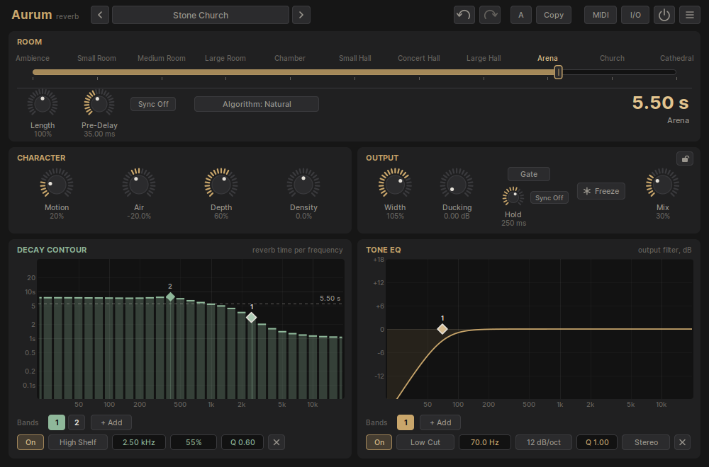

Aurum is an algorithmic reverb. Nothing in it is a recording of a space: every
tail is computed, from a choice of three reverb engines, eleven room models and
a handful of controls that each change one thing you can hear.

What sets it apart is that the reverb time is not one number. The **Decay
Contour** lets you draw how long the reverb rings at every frequency — a hall
whose lows hang on, a room whose highs die early, a plate with a long sparkle
on top — and the bars show the result in seconds, third octave by third
octave. A separate **Tone EQ** then shapes what the reverb sounds like, without
touching how long it lasts.

The window reads from top to bottom the way the sound flows:

1. **Room** — the size and the length of the reverb, the engine, the pre-delay.
2. **Character** — modulation, brightness, distance and density.
3. **Output** — stereo width, ducking, the gate, freeze and the dry/wet mix.
4. **Decay Contour** — the reverb time per frequency.
5. **Tone EQ** — the colour of the reverb.

All of it works on the reverb only; the dry signal passes through untouched
except for the input and output level and pan, and the Mix.

Aurum also brings thirty factory presets with folders, tags, favourites and
search, undo and redo, an A/B comparison, MIDI learn for every control, and an
**impulse response import** that listens to a recording of a real space and sets
the controls to approximate it.

## 2. Getting started

### Installing

Copy the plugin into your host's plugin folder and rescan:

| | CLAP | VST3 |
|---|---|---|
| **Linux** | `~/.clap/` | `~/.vst3/` |
| **Windows** | `C:\Program Files\Common Files\CLAP\` | `C:\Program Files\Common Files\VST3\` |

The CLAP and the VST3 are the same plugin with the same sound and the same
window; install whichever your host prefers. A `.vst3` is a folder — copy it
whole.

**Aurum needs a processor with AVX2 and FMA**: any Intel Core from the 4th
generation (2013) on and any AMD Ryzen. Some low-cost Pentium, Celeron and Atom
models lack it; on those, the host will refuse to load the plugin.

### Channels

Aurum is a stereo effect that also runs as **mono** and as **mono to stereo**;
the host picks the layout from the track it is put on. A mono input still gets a
full stereo reverb in the mono-to-stereo layout.

### On a send or on the track

On an **effect send**, set **Mix** to 100 %, so only the reverb comes back. On
the track itself, Mix sets the balance; the lock button in the Output panel keeps
your Mix when you step through presets (§6).

### Where Aurum keeps its files

| | Linux | Windows |
|---|---|---|
| **Presets** | `~/.local/share/Aurum/Presets` | `%APPDATA%\Aurum\Presets` |
| **Settings** | `~/.config/Aurum/settings.ini` | `%APPDATA%\Aurum\settings.ini` |

The factory presets are written into the preset folder the first time Aurum
opens. The settings file holds what applies to every instance: window size and
scaling, the MIDI map, favourites, Lock Mix and the preset folder.

## 3. The window

Across the top, from left to right:

- **‹ and ›** step to the previous and next preset; the **preset name** opens
  the preset browser (§9). A `*` after the name means the sound has been changed
  since the preset was loaded. Right-click the name to mark the preset as a
  favourite, save it, or save it under a new name.
- **Undo and redo** step through the last 200 changes. **Ctrl+Z** and
  **Ctrl+Shift+Z** do the same.
- **A** switches between two complete settings, A and B, and shows which one is
  active. **Copy** copies the active one into the other slot. Set up a
  variation, switch, compare.
- **MIDI** switches MIDI learn on and off (§11).
- **I/O** opens the input and output level and pan (§12).
- **The power button** bypasses Aurum. The bypass fades instead of cutting, so
  switching it is click-free.
- **☰** is the options menu.

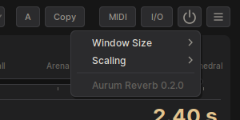

**Window Size** offers three sizes, Medium, Large and Extra Large; the panels
grow with it and the graphs gain room. **Scaling** zooms the whole window from
75 % to 200 %, on top of the scaling your desktop asks for. The window can also
be dragged to any size in hosts that allow it. Window Size and Scaling are
remembered for every instance.

### Working with the controls

| To | Do |
|---|---|
| Turn a knob | Drag up or down. Slow movements are finer than fast ones. |
| Turn it finely | Hold **Shift** while dragging, or while using the wheel. |
| Step it | Use the mouse wheel over it. |
| Reset it | **Ctrl**+click. |
| Type a value | Double-click it, type, press **Return**. **Esc** cancels. |
| Read it | Hover: the name and value appear above it. |
| Pick from a list | Click a selector (Algorithm, Sync, a band's Shape); the wheel steps through it. |

Typed values understand their units: `1.5 s` or `1500` for a time in
milliseconds, `2.5k` for a frequency in kHz, a plain number of seconds for the
Room. **Esc** also closes any open menu or panel.

## 4. Room

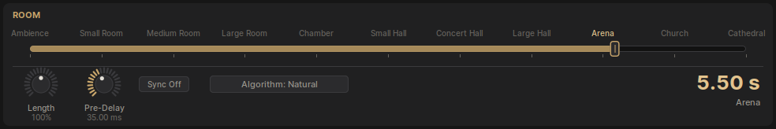

### The ruler

**Room** chooses the size of the space and, with it, the reverb time. The ruler
names eleven room models, each one a complete set of proportions — reflection
pattern, density, how fast the highs die away — and not just a time:

| Room | Time | Room | Time |
|---|---|---|---|
| Ambience | 0.20 s | Small Hall | 2.50 s |
| Small Room | 0.40 s | Concert Hall | 3.20 s |
| Medium Room | 0.75 s | Large Hall | 4.00 s |
| Large Room | 1.25 s | Arena | 5.20 s |
| Chamber | 1.85 s | Church | 7.00 s |
| | | Cathedral | 10.00 s |

Click a name to jump to it, or drag the handle anywhere between two: the room
blends smoothly from one model into the next. Double-click the handle to type a
reverb time in seconds; Aurum finds the room that has it.

### Length

**Length** stretches or shortens the tail of the room, from 25 % to 400 %,
without changing its size. A small room with a long Length is a small, hard
room that rings; a hall with a short Length is a big space that has been
damped.

The large readout on the right is the result: the room's time multiplied by
Length, with the room's name underneath, and the two factors when Length is not
100 %.

### Algorithm

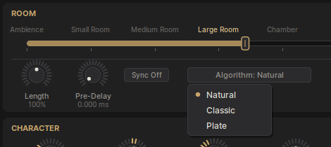

Three reverb engines, each with its own sound:

- **Natural** — a dense, smooth, realistic reverb, built from two networks of
  sixteen delay lines that mix into each other. The choice for rooms and halls
  that should sound like rooms and halls.
- **Classic** — a ring of allpass filters and delays in the manner of the early
  digital reverbs: a little grainier, with a gently wandering tail. Good for
  pads, vocals and anything that wants a familiar studio sound.
- **Plate** — a model of a reverb plate: an immediate, bright, dense onset and a
  smooth, even tail. Room sets the size of the plate.

Every other control works with all three engines.

### Pre-Delay

**Pre-Delay** delays the reverb by up to 500 ms, which keeps the start of a
note or a word clear before the space opens up behind it. A few milliseconds
already separate the source from the room; 30 to 80 ms is the classic vocal
setting.

**Sync** ties the pre-delay to the host's tempo instead: 1/4, 1/8, 1/16 or 1/32
of a note. The knob then becomes **Pre-Delay Offset**, which shortens or
lengthens that note value from 50 % to 200 % — 150 % on an 1/8 is a dotted
eighth. A synced pre-delay is never longer than 500 ms.

## 5. Character

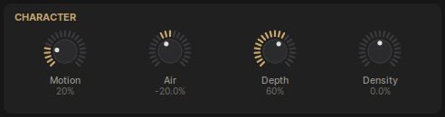

- **Motion** brings the reverb to life. Up to about half way it emphasises the
  early reflections, lets single late echoes stand out and adds a slow, gentle
  modulation that keeps a long tail from sounding static. Beyond half way the
  modulation grows into a chorus: lush, wide and clearly moving — at 100 % it is
  a reverb and a chorus in one.
- **Air** is the brightness of the space. Turned down, the highs of the
  reflections and of the tail are damped and the room sounds soft, heavy,
  furnished; turned up, it is open and glassy. Air also changes how long the
  highs last, which the Decay Contour shows.
- **Depth** is how far away the listener stands. Near, the early reflections
  are strong, bright and immediate; far, they arrive later, are more diffuse and
  blend into a tail that builds up slowly.
- **Density** is how thick the reverb is. Turned down, the reflections thin out
  into distinct echoes — good for a lively, grainy space. Turned up, the reverb
  becomes denser and smoother, and above the middle the signal going into the
  reverb is driven into a soft saturation, which adds warmth and, at the top,
  audible grit.

## 6. Output

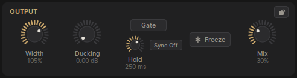

### Width

**Width** sets the stereo image of the reverb:

- **0 %** is mono.
- **Up to 50 %** it opens from mono into a full, enveloping stereo reverb in
  which both input channels feed both sides.
- **From 50 to 100 %** the two sides separate, until at 100 % the left input
  reverberates on the left and the right input on the right — the stereo
  picture of the source is kept.
- **Above 100 %**, up to 150 %, it is wider than the room: the difference
  between the sides is boosted.

### Ducking

**Ducking** turns the reverb down while the input is loud and lets it back up
in the gaps, by up to the number of decibels shown. A vocal stays clear on top
of a big reverb, which then blooms between the phrases. It reacts to the input
relative to its recent loudness, so it works the same on a quiet track and a
loud one.

### Gate

The **Gate** cuts the reverb off a set time after the input stops — the gated
reverb of the eighties drum sound, or simply a big space that does not smear
into the next beat. Switch it on with **Gate**; **Hold** is how long it stays
open after the input falls, from 10 ms to 2 s, and the closing fade grows with
it. **Sync** sets Hold in note values from the host's tempo; the knob then
becomes **Offset**, as with the pre-delay.

### Freeze

**Freeze** closes the reverb's input and holds the tail as it is, for as long as
Freeze is on. Click to switch it on and off; click and hold to freeze only while
the button is held. Freeze a chord into a pad, then play over it.

### Mix and Lock Mix

**Mix** is the balance between the dry signal and the reverb. The lock above it
is **Lock Mix**: while it is closed, loading a preset leaves Mix where it is —
on a send at 100 %, for example. Lock Mix applies to every instance.

## 7. Decay Contour

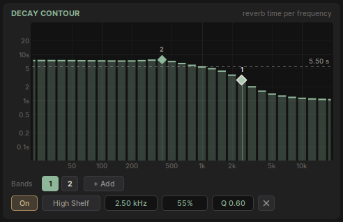

The graph shows **how long the reverb lasts at each frequency**. Each bar is one
third of an octave, from 20 Hz to 20 kHz, and its height is the reverb time
there, in seconds, on the scale on the left. The dashed line is the time in the
Room readout.

Even with no bands the bars are not flat: every room model lets its highs die
faster than its lows, as real rooms do, and Air moves the top end. The bands
then change that, up to six of them:

| Shape | What it does |
|---|---|
| **Bell** | Lengthens or shortens the reverb around one frequency. |
| **Low Shelf** | Lengthens or shortens everything below a frequency. |
| **High Shelf** | Lengthens or shortens everything above a frequency. |
| **Notch** | Cuts the reverb time sharply in a narrow range — a ringing frequency, a boomy room mode. |

Each band's **Rate** multiplies the reverb time where it acts: 100 % leaves it
alone, 200 % doubles it, 50 % halves it, from 12.5 % to 800 %. **Q** sets how
wide a bell or a notch is, and how steep a shelf.

### Editing bands

- **Double-click the graph** to add a bell where you clicked.
- **+ Add** adds a band of the shape you pick from its menu.
- **Drag a handle**: left and right moves the frequency, up and down the
  Rate. Hold **Shift** for fine moves.
- **The wheel over a handle** changes its Q.
- **Double-click a handle** to type its frequency.
- **The numbered chips** under the graph select a band. The row under them is
  the band's **inspector**: on/off, shape, then frequency, Rate and Q — fields
  that can be dragged, scrolled, Ctrl+clicked and double-clicked like a knob —
  and **×**, which deletes the band.
- **Right-click a handle or a chip** to switch the band off or delete it.
  **Delete** or **Backspace** deletes the selected band while the pointer is
  over the panel.

What the bars show is what you hear: the engine is built so that the measured
reverb time follows the drawn curve closely, band by band.

## 8. Tone EQ

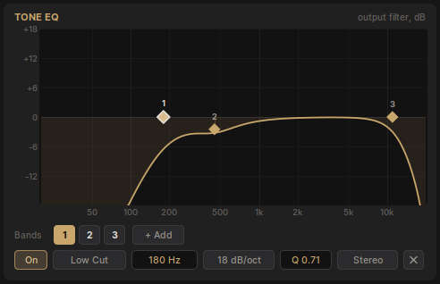

The **Tone EQ** colours the reverb: how bright, how warm, how much low end it
returns. It acts on the reverb's output, so unlike the Decay Contour it does not
change how long anything lasts — a low cut here thins the reverb's bass without
shortening it. It never touches the dry signal.

Up to six bands:

| Shape | Parameters |
|---|---|
| **Bell** | frequency, gain (±30 dB), Q |
| **Low Shelf**, **High Shelf** | frequency, gain, Q |
| **Low Cut**, **High Cut** | frequency, slope from 6 to 96 dB per octave, Q (resonance at the corner) |

The bands are edited exactly like the Decay Contour's: double-click the graph,
**+ Add**, drag the handles (up and down is the gain), the wheel for Q, the chips
and the inspector row.

Aurum keeps the level of the reverb steady while you equalise it: cutting the
lows or the highs does not make the reverb quieter overall, it changes its
colour.

### Placement

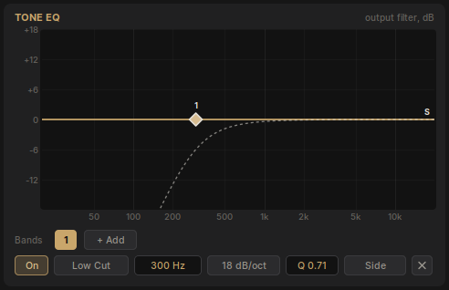

Each band also has a **placement**: **Stereo** (both sides), **Left**,
**Right**, **Mid** (what the sides have in common) or **Side** (the difference
between them). A band that works on one part only is drawn as a dashed curve
with its letter. A low cut on the side signal, for example, keeps the reverb's
low end in the middle where it belongs, while the highs stay wide.

## 9. Presets

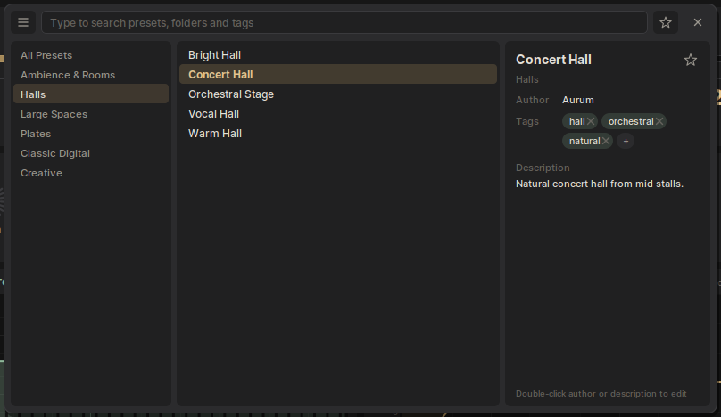

Click the preset name to open the browser.

- **Folders** on the left; **All Presets** shows everything.
- **Search**: just start typing. The list narrows to presets whose name, folder
  or tags match. **Backspace** removes a letter.
- **Click** a preset to hear it with the browser still open; **double-click**
  it, or press **Return**, to load it and close the browser. **Up** and **Down**
  move through the list, **Right** loads without closing, **[** and **]** step
  to the previous and next preset while the search is empty, **Esc** closes.
- **Favourites**: the star in the details panel marks the preset; the star next
  to the search field shows favourites only.
- **Details**: author, tags and description. Double-click the author or the
  description to edit it; **+** adds a tag, **×** removes one.

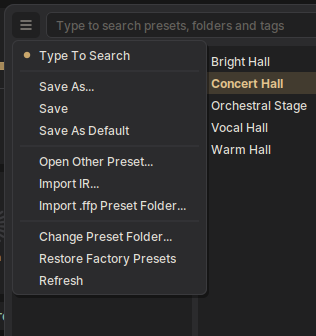

The **☰** menu at the top left of the browser:

- **Type To Search** — when off, the browser takes typing only after a click
  into the search field.
- **Save As…** — saves under a new name. Type `Folder/Name` to save into a
  folder; new folders are created as needed.
- **Save** — overwrites the current preset.
- **Save As Default** — makes the current sound the one every new instance of
  Aurum starts with. It replaces the **Init** preset.
- **Open Other Preset…** — loads a preset file from anywhere on disk.
- **Import IR…** — see §10.
- **Import .ffp Preset Folder…** — converts a folder of `.ffp` text presets
  from another reverb into Aurum presets, in a folder called **Imported**. The
  engines differ, so a converted preset is a starting point that matches the
  original's size, decay, tone and settings as closely as Aurum's controls
  allow, not a copy of its sound.
- **Change Preset Folder…** — keeps your presets somewhere else, a synced
  folder for example.
- **Restore Factory Presets** — writes the factory presets back, undoing any
  changes made to them, including to Init. Your own presets are not touched.
- **Refresh** — rereads the folder after you have changed files outside Aurum.

Presets are small text files with the extension `.aurum`, and can be copied,
shared and kept in folders of your own.

### The factory library

{{PRESET_LIBRARY}}

## 10. Importing an impulse response

An impulse response is a recording of a space answering a short sound: a
clap, a starter pistol, a balloon, or a sine sweep already turned into an
impulse. Aurum can listen to one and set itself up to resemble that space.

Choose **Import IR…** in the browser's menu, or drag a WAV or AIFF file onto
the window. Aurum measures how long the recording rings in each band, its
spectrum, how wide it is, how its early energy compares to its tail and how long
it takes to start, and sets Room, Length, the Decay Contour, the Tone EQ,
Width, Depth and Pre-Delay to match. Mix and the I/O settings are left as they
were. The preset name becomes **IR:** and the file's name, and a message shows
the measured reverb time.

Aurum is not a convolution reverb: the import gives you an algorithmic reverb
with the same proportions — length, colour, width — that you can then change
like any other preset. It needs a real impulse response; a raw sine sweep or a
piece of music is recognised and refused.

## 11. MIDI learn

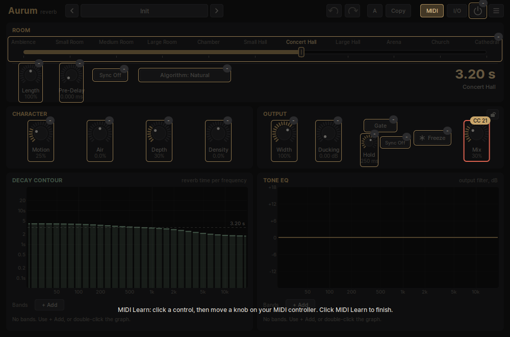

Every control in the window can be moved from a MIDI controller. Route the
controller to Aurum's MIDI input in your host — Aurum has a MIDI input port for
this, even though it is an effect — then:

1. Click **MIDI**. Every learnable control is outlined, with a bubble showing
   its controller number, or `-` if it has none.
2. Click a control. Its outline turns red.
3. Move a knob or fader on the controller. The control now follows it.
4. Repeat for other controls, and click **MIDI** again to finish.

The mappings are saved when you finish, and they belong to Aurum rather than to
a project: every instance and every project uses the same map. Right-click
**MIDI** for:

- **Enable MIDI** — switches MIDI control off without forgetting the map.
- **Clear** — removes one mapping, or all of them.
- **Revert** — goes back to the last saved map.
- **Save** — saves the map now.

Aurum listens to control change messages on every MIDI channel.

## 12. Input, output and bypass

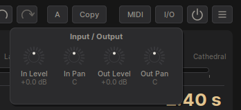

**I/O** opens four controls that sit outside the reverb: **In Level** and **In
Pan** before it, **Out Level** and **Out Pan** after it, each level from
-36 dB to +36 dB. The input controls change what the reverb hears — and what
the ducking and the gate react to — while the output controls change
everything that leaves Aurum, dry and wet together.

The **power button** in the top bar is Aurum's bypass, which the host can also
automate. It fades between the processed and the untouched signal over 20
milliseconds, so it can be switched while the music plays.

## Appendix. Every parameter

Every parameter with its range and starting value, generated from the plugin
itself when this manual was built, under the names the host shows for automation.

{{PARAMETER_SUMMARY}}
