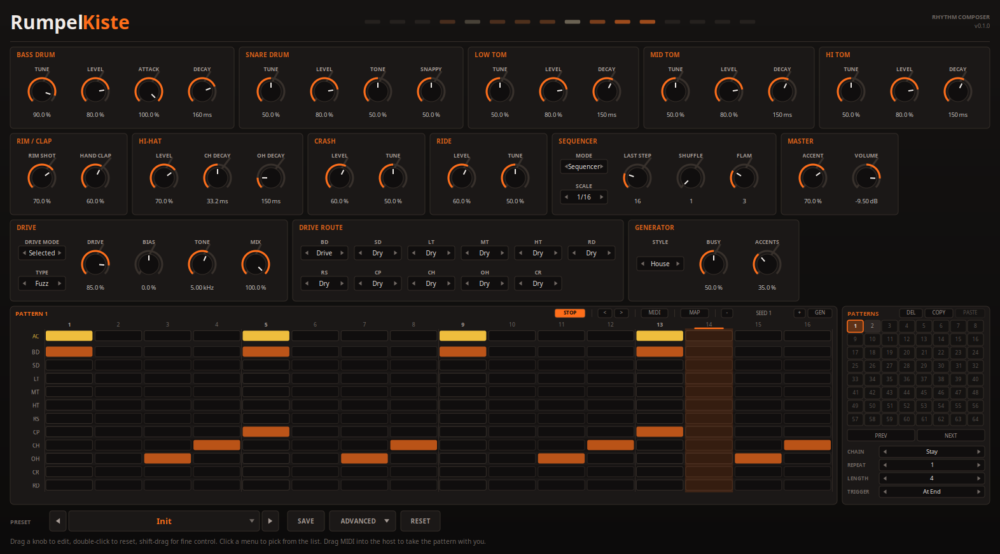
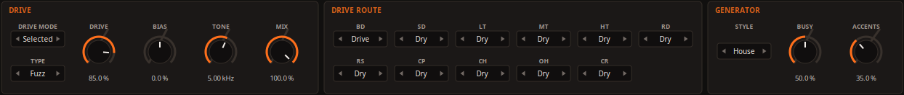
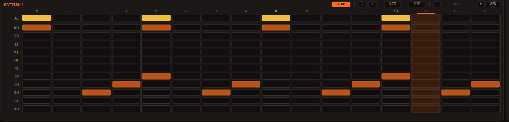
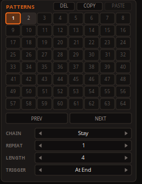

# {{PLUGIN}} — manual

*A drum machine with its own step sequencer. Linux and Windows, CLAP and VST3.*

Version {{VERSION}}

---

[TOC]

## 1. What it is

RumpelKiste models the voicing board of the classic 1984 rhythm composer — the
grey box with the orange keys that house and techno were built on — as its
service notes draw it. Eleven voices: bass drum, snare, three toms, rim shot,
hand clap, closed and open hi-hat, crash and ride. The first seven are analog
circuits and are modelled as circuits: triangle oscillators, capacitor
envelopes, filters and amplifiers, with every time constant and corner
frequency worked out from the component values. The hi-hats and cymbals were
six-bit samples in the machine's ROMs, and here they run through the same
six-bit path with a synthesised stand-in for the recordings — see §5.

It plays two ways: from the host, on the machine's own MIDI key numbers, or
from its own sequencer, which runs one to sixty-four steps and draws on a bank
of sixty-four patterns.

One stage is added that the machine does not have: a **drive bus** with ten
distortion models, which can take the whole kit or only the voices you choose
— see §4.

Seventy-six parameters, nineteen presets.

Not affiliated with or endorsed by Roland Corporation. *TR-909* is their
trademark, used here only to name what was modelled.

## 2. Playing it

**Mode**, on the SEQUENCER panel, says whether the pattern plays.

- **Sequencer** runs the pattern bank locked to the host's transport. Start the
  host and the pattern starts on the song's beat; loop, scrub or change the
  tempo and it follows. With the host stopped, the **PLAY** button in the
  grid's title row runs the pattern on its own at the host's tempo.
- **MIDI** switches the sequencer off and leaves the host to play the voices.

In both modes incoming notes play the voices, on the machine's own key numbers
— which are also where the General MIDI drum map puts them:

| Key | Voice | Key | Voice |
|-----|-------|-----|-------|
| 35, 36 | Bass drum | 42, 44 | Closed hi-hat |
| 37 | Rim shot | 45, 47 | Mid tom |
| 38, 40 | Snare drum | 46 | Open hi-hat |
| 39 | Hand clap | 48, 50 | Hi tom |
| 41, 43 | Low tom | 49, 57 | Crash |
| | | 51, 53, 59 | Ride |

So you can play along with the pattern from a pad controller, or program the
drums in the host's piano roll with Mode on MIDI.

### Accent

The machine's accent is a switch, not a curve, and it has two kinds:

- **Total accent** is a property of a step. Every voice playing on an
  accented step is raised by the **Accent** knob on the MASTER panel.
- **Local accent** belongs to one voice on one step, and has a fixed strength
  (**Local Accent**, under ADVANCED).

An accent does more than raise the level. It reaches every envelope in a
voice: an accented kick sweeps from higher up and clicks harder, an accented
snare has more snap. And an unaccented hit is quiet — about a third of an
accented one on the bass drum, which is how the machine is. **A pattern with no
accents in it will sound small**; the accent row is the first thing to reach
for.

From MIDI, a note at or above **Accent At** (default 100) plays with the
Accent knob's accent, and one below plays plain.

## 3. The voices

Every Level knob is a plain volume. What the others do is below; the numbers
in brackets are what the circuit gives.

### Bass drum

A triangle oscillator rounded towards a sine by a pair of diodes, swept down
from a high start by two envelopes, with a click on the front.

- **Tune** does not tune the kick. It sets how long the pitch *stays up* after
  the hit (a 7 ms to 40 ms time constant), which is heard as a higher, longer
  "boom" or a short, dry "thud". The note the kick settles on is fixed by the
  circuit; it is **BD Pitch** under ADVANCED.
- **Attack** mixes a pulse and a burst of low-passed noise into the first
  millisecond or two. Fully down leaves the plain oscillator.
- **Decay** is the amplitude envelope (15 ms to 345 ms time constant). Fully
  down all but mutes the kick, which is what the machine's own manual suggests
  doing with it.

### Snare drum

Two oscillators a ratio of 1.47 apart, bent up at the hit, and two noise paths.

- **Tune** moves both oscillators together, across exactly one octave.
- **Tone** is how long the noise tail lasts (47 ms to 282 ms). A longer tail is
  a brighter, splashier snare.
- **Snappy** is how much noise there is at all: a short burst of high-passed
  noise as long as the trigger, and the low-passed tail Tone sets. Fully down is
  the drum with the snares off.

### Toms

Three oscillators per tom, at 1, 1.5 and 2.75 times the lowest, bent down at
the hit, with a tick of noise at the front.

- **Tune** spans exactly one octave. At the same setting the mid tom sits 1.22
  times above the low one and the hi tom 1.5 times — so the three overlap, and
  can be tuned to a phrase. The **Melody Toms** preset does that.
- **Decay** is the main oscillator's envelope (38 ms to 378 ms).

### Rim shot and hand clap

Neither has a control beyond its level.

- The **rim shot** is three resonators rung by one pulse — at 219 Hz, 495 Hz
  and 1053 Hz — clipped hard by a pair of diodes and high-passed at 495 Hz.
  The clipping is the sound.
- The **hand clap** is noise through a 960 Hz band-pass, cut into four bursts
  about nine milliseconds apart, with a darker tail rising under them.

### Hi-hat

One voice with two decays, because on the machine it is one voice: the same
sample memory read from two places through one amplifier. **A closed hat cuts
off an open one**, and one Level serves both.

- **CH Decay** and **OH Decay** set how fast the level falls. The amplifier is
  a logarithmic one, so the hat falls evenly in decibels and then slows — a
  different shape from the analog voices. The closed hat's range is a tenth of
  the open hat's.

### Crash and ride

- **Tune** is the speed the sample memory is read at, a fifth either way. Like
  retuning a sample, a higher setting is higher *and shorter*.

The ride has a ping over a longer wash; the crash is one long shimmer.

## 4. The drive bus

The machine has no distortion. This is an insert on its output: ten models,
each an equation out of the literature or a pedal's own circuit, and built
differently from each other rather than merely curved differently.

**Drive Mode** says what goes through it:

- **Off** — nothing. The machine as it is.
- **Master** — the whole mix, like a drum machine plugged into a pedal.
- **Selected** — only the voices whose switch on the DRIVE ROUTE panel says
  **Drive**. The rest stay clean. A distorted kick under crisp hats, or a clap
  through a fuzz on its own.

**Drive** is how hard the bus is pushed, level-matched so that turning it up
thickens rather than simply gets louder. **Bias** moves the model off its
centre, which puts even harmonics in. **Tone** takes the top off afterwards.
**Mix** blends the driven bus with its clean self — a hard model at 30 % is a
layer under the drums rather than instead of them.

| Model | What it is |
|-------|------------|
| **Soft Clip** | The gentlest: a smooth ceiling. |
| **Overdrive** | Clean below a third of full scale, so quiet hits pass untouched and loud ones break up. |
| **Tube** | Sits off centre on its curve: much harder on one half of the wave, which is where its even harmonics come from. |
| **Valve Stack** | Three gain stages in a row with a filter between them. |
| **Fuzz** | No clean region at all. |
| **Rectifier** | Folds the wave, which doubles every pitch: on a kick or a tom, an octave above itself. |
| **Crush** | Bit reduction. |
| **Germanium** | A 1970s stompbox, modelled component by component: it distorts the upper harmonics and leaves the fundamental alone. |
| **Crunch** | One channel of a 1993 dual overdrive, from its service notes. |
| **Lead** | The other channel of the same pedal: more gain, a different circuit. |

The hi-hat is one voice, so the closed and open hat each follow their own
route switch according to which one played last.

## 5. The hi-hats and cymbals, and what stands in for the ROMs

On the machine the hats, crash and ride are recordings of real cymbals, stored
as six-bit samples. The samples were **compressed** before they were stored —
flattened out, so the quiet end of each sound kept its resolution — and the
circuit puts the decay back afterwards with an amplifier driven from the read
position or from a decay capacitor.

The recordings themselves are not reproduced here. What plays instead is a
synthesised metal sound, generated one sample at a time at the memory's own
clock and put through everything the real data goes through: the six-bit
converter, the hold between clock edges, and the envelope that restores the
decay. That last part matters more than it sounds. Because the decay comes
*after* the converter, the six-bit grit fades with the cymbal instead of
sitting under it, which is a large part of why these voices sound the way they
do.

Under ADVANCED:

- **Hat Color** and **Cym Color** set how bright the stand-in is.
- **DAC Bits** is the converters' resolution. Six is the machine. Four is
  louder grit; sixteen is clean.

## 6. The sequencer

### The grid

Twelve rows. The top one, **AC**, is the total accent. The eleven below are
the voices in the machine's key order: BD, SD, LT, MT, HT, RS, CP, CH, OH, CR,
RD.

- **Click** a step to cycle it: off, on, accented, off. Accented steps are the
  bright ones.
- **Shift-click** a bass drum, snare or tom step to **flam** it (see below). A
  flam shows as a notch in the cell.
- **Right-click** clears a step.
- **Drag** paints whatever the first click made along the row — the only
  civilised way to write sixteen hats. A shift-drag paints the flam and leaves
  each step's level alone.
- **Click a voice's name** to mute it; it turns red and stays silent until
  clicked again. **Right-click a name** to hear the voice once. A name lights
  up when its voice plays.

The **<** and **>** buttons walk the whole pattern a step left or right, every
row at once.

### Length, scale, shuffle and flam

On the SEQUENCER panel:

- **Last Step** is where the pattern starts again, 1 to 64. The machine stopped
  at sixteen. Past sixteen the grid shows thirty-two narrower columns, and past
  thirty-two it scrolls.
- **Scale** is what one step is worth: a sixteenth, an eighth-note triplet, a
  thirty-second or a sixteenth-note triplet. The triplet scales want Last Step
  on 12 for one bar.
- **Shuffle** has the machine's seven settings. 1 is straight; each setting
  above it delays the second step of every pair a little more, and 7 is a
  triplet feel.
- **Flam** has the machine's eight settings: the gap between the two strokes of
  a flammed step. The first, lighter stroke lands on the step and the full one
  follows — and the gap does not change with the tempo.

### The pattern bank

Sixty-four patterns, as an eight-by-eight grid beside the steps. Click one to
edit it and to play it next; a used pattern is shaded, the playing one has a
bright outline, and a pattern waiting for its turn flashes.

- **PREV** and **NEXT** step through the bank.
- **DEL** empties the selected pattern. **COPY**, click another, **PASTE**.
- **CHAIN** is what the pattern on screen does when it has played through.
  Every pattern has its own: **Stay** repeats it, **Next** moves to the
  following one and wraps round at **LENGTH**, **First** goes back to
  pattern 1, **Random** picks one from inside the chain.
- **REPEAT** is how many times the pattern plays before its chain moves on.
- **TRIGGER** is when a pattern you pick while the sequencer runs takes over:
  **At End** waits for the playing one to finish, which is the machine;
  **Instant** switches on the next step and keeps the place in the bar;
  **Restart** switches on the next step and plays the new one from its start.

The chain is worked out from the host's beat position, so looping a bar or
jumping around the song always lands on the pattern that belongs there.

### Changing patterns from a pad: MAP

**MAP** turns the bank into a pad layout. Click MAP, click a pattern (or PREV
or NEXT), then play the note you want for it. From then on that note selects
the pattern instead of playing a drum. Right-click a pattern in MAP to unbind
it, or right-click MAP itself to clear every binding. MAP is only there in
Sequencer mode. The bindings belong to your setup rather than to a sound, so
they are saved with the project and not with presets.

### Taking the pattern with you

Drag the **MIDI** button into the host and drop it on a track: the pattern
arrives as a MIDI clip, on the key numbers above, with accents as velocity and
flams as two hits. Set Mode to MIDI and the plugin plays it back as it was.

### What goes out of the note port

While the sequencer runs, every hit also goes out of the plugin's note output,
on the same keys, so the pattern can drive another instrument or be recorded.

## 7. The pattern generator

**GEN**, in the grid's title row, writes a new pattern into the one on screen,
using the GENERATOR panel's settings:

- **Style**: House, Techno, Electro, Breaks, Garage or Wild. Each is a set of
  likelihoods for every voice on every step of the bar — where the kick lands,
  where the claps go, whether the hats run in sixteenths or sit on the
  off-beat. Wild keeps a kick on one and throws the rest away. A pattern longer
  than a bar gets a fill in its last bar.
- **Busy**: how much is written. Low keeps what defines the style; high adds
  ghost notes, tom runs and extra hats. Turning it up **adds** hits to the
  pattern you have rather than writing a different one.
- **Accents**: how many steps carry an accent. It moves accents and nothing
  else.

Every pattern comes from a **seed**, shown between the **-** and **+** buttons.
The same seed with the same settings always writes the same pattern, so a
groove you like is a number you can write down. GEN picks a new seed; - and +
step through them; click the seed to type one.

## 8. Presets and kits

The preset bar's arrows step through the library and the name opens the
browser. **SAVE** writes the current state as a preset: the sound, the whole
pattern bank and every pattern's chain. Type "Folder/Name" to save into a
folder. The browser can write a folder out as one pack file and read packs
back in.

A preset that carries patterns replaces the bank. **A kit** is a preset that
carries none: it changes the sound and leaves the patterns — and how they are
played — alone, so it can be tried under whatever groove is running. The
factory library has three, and a preset you write becomes a kit if you delete
its pattern lines.

**RESET**, clicked twice, puts every control back to the factory, including
the mods, but leaves the patterns, the play mode and the clock alone.

### The factory library

{{PRESET_LIBRARY}}

## 9. Where the numbers came from

Every number in this instrument is one of three things: worked out from the
circuit diagram's component values, printed in the service notes, or fitted
because neither gives it.

The worked-out ones are fixed. The snare's two oscillators are 1.47 apart
because that is the ratio of their capacitors; the rim shot rings at 495 Hz
because that is what its resistors and capacitors make; the toms tune over an
octave because their tuning pots sit in a two-to-one divider; the clap has four
bursts because the printed waveform shows four.

**The fitted ones are all controls.** They are the mods under ADVANCED, and the
number that was fitted is each one's default: the frequency the kick settles
on, how far it sweeps, the snare's and the toms' pitch, how long the rim shot's
gate stays open, the clap's spacing, the brightness of the cymbal stand-ins,
the strength of the local accent, the shuffle and flam units. The guesses are a
starting point you can disagree with, not decisions buried in the engine.

The honest summary: this is built from a circuit diagram and its printed
waveforms. It has not been compared against a real machine by ear.

## Appendix. Every parameter

The chapters above explain what each control is for. This table is the
complete list, with every range and every starting value, generated from the
instrument itself when this manual was built.

{{PARAMETER_SUMMARY}}
