# SäureKiste — manual

*A monophonic acid bass synthesiser. Linux and Windows, CLAP and VST3.*

Version 0.7.0

---

[TOC]

## 1. What it is

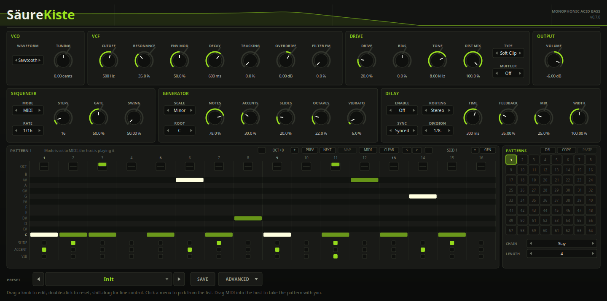

SäureKiste models the main board of the popular silverbox — the little bass
machine every acid record was made on — as its February 1982 service notes
draw it: a relaxation-oscillator VCO, a four-stage transistor
ladder filter, a VCA, a decay-only envelope, an accent circuit, and a slide lag
on the pitch CV. Two stages are added that the machine does not have — a drive
stage of seven models after the filter, and a delay after that — and both are
marked as such everywhere they appear.

It is **monophonic** and it tells the host so.

It plays two ways: from the host, or from its own sequencer, which runs 1 to 128
steps and draws on a bank of sixty-four patterns.

It also models a well-known hardware **modification** of the same machine, from
its author's own published manual — see §10. Every one of those controls
defaults to the stock circuit, so the plugin is the original until you ask it
not to be.

Sixty-three parameters, twenty-seven presets.

Not affiliated with or endorsed by Roland Corporation. *TB-303* is their
trademark, used here only to name what was modelled. Not affiliated with or
endorsed by Robin Whittle; *Devil Fish* is his, and is used only to name the
modification that was modelled.

## 2. Playing it

**Mode** decides where the notes come from.

In **MIDI** the host plays it, and the two things the machine's sequencer used
to say per step are recovered from what a piano roll already has. In
**Sequencer** the plugin plays its own pattern and a held MIDI note transposes
it. In **Live** it plays its own pattern too, but the keys select patterns
instead of transposing — see §6.

Everything below applies to both.

### Accent

In MIDI mode, a note whose velocity is **at or above the Accent At threshold**
(100 by default) is accented; in Sequencer mode it is the step's accent bit. Everything below it is not. It is a switch and not a
curve, because the hardware's accent was one bit per step.

An accented note is three things at once:

- **louder**, by the amount the Accent knob sets;
- **brighter**, because the accent circuit adds to the filter's cutoff CV;
- **shorter**, because the ACCENT line gates an analog switch onto the envelope
  node and bypasses the Decay knob entirely. On the hardware this is not
  optional; a later modification made it switchable, which tells you how
  strongly people felt about it.

The brightness does not stop when the note does. The accent charges a capacitor
which then discharges over **68 ms** — long enough that a note landing a
sixteenth later is still sitting in the tail of it. That is where an acid line
gets its breathing quality, and **Sweep Time** is that time constant.

### Slide

**Overlap two notes** and the second slides from the first. Extend a note in the
piano roll so it runs past the start of the next one; in Sequencer mode, tick
the step's Slide box and the sequencer does the overlapping for you.

What matters is what does *not* happen: nothing retriggers. The filter envelope
carries straight on through the join and the amplifier does not start again,
because on the machine a slid step holds the gate high and never fires a new
trigger. A slide is therefore audibly different from two legato notes.

Releasing the upper of two held notes slides back down to the lower one, for the
same reason.

## 3. The controls

Eight are the machine's front panel. Six are not, and are marked **(added)**.

### VCO

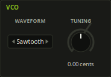

| Control | Range | Default | |
|---|---|---|---|
| **Waveform** | Sawtooth / Square | Sawtooth | Switch S1. The sawtooth falls rather than rises — the oscillator is an integrator that ramps down and is snapped back up. The square arrives at the filter **6.7 dB down**, because the schematic prints both swings: 12 V to 5.5 V for the saw and 8 V to 5 V for the square. That difference is reproduced rather than normalised away. |
| **Tuning** | ±700 cents | 0 | VR2. The service notes give its travel as approximately a perfect fifth either way. |

### VCF

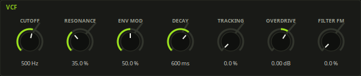

| Control | Range | Default | |
|---|---|---|---|
| **Cutoff** | 100 Hz – 2.5 kHz | 500 Hz | VR3. The centre is 500 Hz because the factory alignment procedure puts it there: with cutoff centred and resonance full, TM3 is trimmed until the filter rings at 2 ms ± 0.5 ms, and 2 ms is 500 Hz. |
| **Resonance** | 0 – 100 % | 35 % | VR4. It stops just short of oscillation, because the machine does — the ringing waveform printed for that alignment check dies away. A silverbox that sustains a tone is a modified one. |
| **Env Mod** | 0 – 100 % | 50 % | VR5, and the one control that does two things at once. See §4. |
| **Decay** | 200 ms – 2.5 s | 600 ms | VR6. The range is printed on the schematic. The envelope has no attack worth the name and no sustain at all — it is triggered and it falls. An accented note ignores this knob. |
| **Tracking** *(added)* | 0 – 100 % | 0 % | Filter key follow. The machine has **none**: its pitch CV reaches the oscillator and stops, so a note two octaves up meets the same filter as the root. 0 % is the machine. |

### Accent

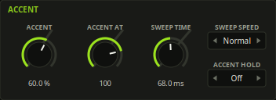

| Control | Range | Default | |
|---|---|---|---|
| **Accent** | 0 – 100 % | 60 % | VR7. How much louder, brighter and shorter an accented note is. |
| **Accent At** *(added)* | 1 – 127 | 100 | Which velocities count as an accent. |
| **Sweep Time** *(added)* | 10 – 500 ms | 68 ms | The accent's time constant. 68 ms is the circuit's own: C62 is 1 µF and discharges through R138, 68 k. Shorten it and each accent stands alone; lengthen it and a run of them builds. |

### Slide

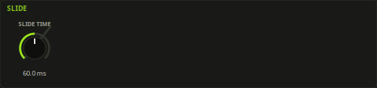

| Control | Range | Default | |
|---|---|---|---|
| **Slide Time** *(added)* | 10 – 300 ms | 60 ms | Fixed on the hardware by C35 (0.22 µF) and its resistor network; a control here because the notes now come from a host. 60 ms is where the original sits. |

### Drive *(the whole panel is added)*

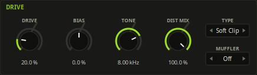

| Control | Range | Default | |
|---|---|---|---|
| **Drive** | 0 – 100 % | 20 % | How hard the model is worked. What it actually moves depends on the model: Schetzen's thresholds, Bendiksen's `dist`, a triode's saturation, a bit depth. |
| **Bias** | −100 – +100 % | 0 % | Where the model sits on its own curve. At the centre each one is at the operating point its source specifies; away from it the two halves of the wave are treated differently, which is what puts even harmonics into a sound that otherwise has only odd ones. |
| **Tone** | 800 Hz – 18 kHz | 8 kHz | A lowpass after the drive. At the top of its range it does nothing. |
| **Type** | 7 models | Soft Clip | Which model the stage is. See below. |
| **Dist Mix** | 0 – 100 % | 100 % | How much of the driven signal is heard against the clean one. At zero the stage is bypassed however Drive and Type are set. |

#### The seven models

Everything in front of this stage is fixed by the service notes. There is no
schematic for the stage itself, so it is built the other way round — from the
literature. Every model is an equation out of a named source:

- **[DAFX]** U. Zölzer (ed.), *DAFX: Digital Audio Effects*, 2nd edition, Wiley
  2011, chapter 4, *Nonlinear processing* (Dutilleux, Dempwolf, Holters,
  Zölzer).
- **[Pirkle]** W. Pirkle, *Designing Audio Effect Plugins in C++*, 2nd edition,
  Routledge 2019, chapter 19, *Nonlinear Processing: Distortion, Tube
  Simulation, and HF Exciters*.

| Type | Source | What it is |
|---|---|---|
| **Soft Clip** | — | The stage this instrument has always had: a rational tanh. The default, so a preset written before the models existed sounds exactly as it did — and the loudest of them at any given Drive, because its gain reaches 24 and it is compressing hard by the middle of the knob. |
| **Overdrive** | [DAFX] eq 4.14 (Schetzen) | Symmetrical soft clipping in three zones: **linear** below a third of full scale, compressing to two thirds, flat above. The linear zone is the point of it — a note stops being distorted as it decays, so the stage follows the playing instead of flattening everything equally. |
| **Tube** | [DAFX] eq 4.13 (Bendiksen) + M-file 4.4 | Asymmetric soft clipping around a work point: roughly linear for positive values and hard-limited for negative ones. At the book's own Q = −0.2 the positive half reaches 0.95 and the negative is held at 0.25, and almost all of its harmonics are even. The M-file's highpass and lowpass are in the path too. |
| **Valve Stack** | [Pirkle] 19.12, 19.13 | Four class-A triode stages in series, each with the DC-removing highpass and the cathode-bypass shelf the book gives them, and the two-band tone stack it puts between the third stage and the fourth. The one model with a frequency response of its own: thinner at the bottom, brighter at the top. A power stage after the cascade keeps it inside its bounds, which is what a real one has too. |
| **Fuzz** | [DAFX] eq 4.15 + [Pirkle] FEXP1, eq 19.2 | Exponential from the first volt — no linear region at all, which is what "fuzz" means. Asymmetric by default, because both sources describe it that way: the Fuzz Face clips its negative half lower than its positive one. |
| **Rectifier** | [DAFX] 4.3.3, [Pirkle] table 19.2 | Folds the negative half of the wave onto the positive one, which doubles the number of zero crossings and therefore the fundamental. An octave *over* the note rather than an edge on it, and the only model here that changes the pitch of what it is given. Bias runs it from half-wave to full-wave. |
| **Crush** | [Pirkle] eq 19.1 | Quantised to fewer bits, twelve down to three. Digital rather than a circuit, and unmistakable. |

A hard model is made usable with **Dist Mix**: Fuzz or Rectifier at 25 % adds
something to a line that is otherwise still the machine.

**Both sources say the same thing about aliasing** — a nonlinearity needs
oversampling ([DAFX] 4.1.1 and figure 4.5, [Pirkle] 19.1) — so every model here
runs at twice the sample rate with an interpolating filter on the way in and a
band-limiting one on the way out. Soft Clip is the exception, and deliberately:
it is the stage that predates all of this and it renders what it always did.

**Why seven and not fourteen.** There were fourteen, once, and they all sounded
the same. Any two memoryless clippers driven hard enough become the same square
wave; matching their levels removes what little is left; and none of them had
any filtering of its own. What tells these apart is that they are built
differently — a linear region that survives, an operating point off centre,
four stages in series with a tone stack between them, a rectifier, a quantiser —
and it is measured rather than taken on trust: each model's Drive is set to
wherever it gives 25 % total harmonic distortion, and the harmonics it makes
there are compared with the others'. Any two clippers meet at the top of the
knob, so that is the setting where a difference has to show if it is real.

### Delay *(the whole panel is added)*

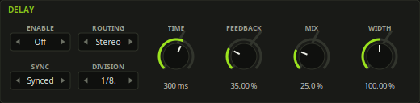

The machine has no delay and never had one. This is the second stage here that
comes out of the literature rather than off the schematic — the first is the
drive — and it sits after everything else, where a box plugged into the back of
the machine would have sat.

| Control | Range | Default | |
|---|---|---|---|
| **Enable** | Off / On | Off | Whether the stage is in the path. Off is a true bypass, but the lines keep what is in them, so switching back on carries on rather than starting from silence. |
| **Sync** | Free / Synced | Synced | Where the time comes from: the Time knob, or the host's tempo and the Division chip. |
| **Time** | 20 – 2000 ms | 300 ms | The delay time when Sync is Free. Does nothing when it is Synced. |
| **Division** | 1/32 – 1/2 | 1/8. | The delay time as a note value, when Sync is Synced. |
| **Feedback** | 0 – 130 % | 35 % | How much of each repeat makes the next one. See below. |
| **Mix** | 0 – 100 % | 25 % | The repeats against the dry instrument, as a crossfade. At 100 % the instrument itself is gone. At zero the stage is bypassed. |
| **Routing** | Mono / Stereo / Ping-Pong | Stereo | How the two lines are wired. See below. |
| **Width** | 0 – 200 % | 100 % | How far the repeats are spread, over the delay's own output only — the dry instrument does not move. Nothing to do in Mono. |

**The three modes.** Mono is one line heard in both channels; the repeats sit
where the instrument does. Stereo is two lines, the right one running at two
thirds of the left, so the repeats interleave — two lines at the *same* time
would not be a stereo delay at all, only a wider mono one. Ping-Pong sends the
instrument into the left line and crosses the feedback, so each repeat walks
from one side to the other and back.

That last one is the one place the implementation leaves its source. The book's
figure crosses the *inputs* as well, which works for a stereo source and does
nothing at all for a monophonic one: both lines would be fed the same signal,
both taps would stay equal for ever, and the mode would be the mono delay with
extra arithmetic. What the figure is actually for is that the first repeat
lands on one side and the second on the other, and that is what you get.

**Feedback above 100 %**, and why it does not blow up. Up to 100 % the stage is
the IIR comb filter its source prints, and the repeats die away. Past it they do
not: the source states the stability condition outright — above unity "the
signal would grow endlessly" — and that is broken here on purpose. What holds
the loop up instead is the same soft clipper the instrument's own output stage
uses, inside the feedback path. The repeats grow, saturate, and then sit there
as a self-oscillating drone that can be played over. It cannot run away, and it
will not stop by itself either: Enable off, or Mix at zero, is how it is
stopped.

**Turning Time while it runs** bends the repeats rather than clicking. The read
head glides to a new setting over about 50 ms, which is a tape delay's behaviour
and is worth having on purpose; a host moving the tempo under a synced delay
does the same thing.

### Output

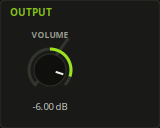

| Control | Range | Default | |
|---|---|---|---|
| **Volume** | −60 – 0 dB | −6 dB | VR8. It stops at unity rather than offering makeup gain, because the service notes give the output stage's gain as unity and there is nothing above it. |

### Mods *(the whole panel is added)*

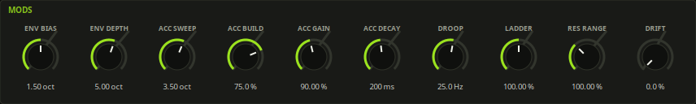

Ten numbers that the schematic does not give. They used to be constants in the
engine, which meant shipping one particular guess; they are controls instead,
with those guesses as their defaults. Nothing moved — a preset that does not
mention them sounds exactly as it did.

They are also close to the list of things people soldered into their own
machines, and there is a reason that list is short and specific: no two of these machines
agreed anyway. Matched transistor pairs, a posistor and twenty years of drift
saw to that, so “the” silverbox sound was never one sound. This is where you pick
yours.

| Control | Range | Default | |
|---|---|---|---|
| **Env Bias** | 0 – 3 oct | 1.5 | How far Env Mod drops the resting cutoff as it deepens the sweep — the size of Q9's trick (§4). At **zero the gimmick is off** and Env Mod becomes an ordinary envelope-amount knob, which is worth hearing once. |
| **Env Depth** | 1 – 8 oct | 5.0 | How deep a full sweep is. |
| **Acc Sweep** | 0 – 6 oct | 3.5 | How far a full accent opens the filter. This is the control that decides whether an accent reads as one at all: an accented note is also running a much shorter envelope, so too little here and the shortening wins and the accent comes out *darker*. It did, at two octaves. |
| **Acc Build** | 0 – 100 % | 75 % | How much of C62 one accent fills. Below 100 % an accent lands on what the last one left, so a run of them builds. |
| **Acc Gain** | 0 – 200 % | 90 % | How much louder an accent is. |
| **Acc Decay** | 20 ms – 2.5 s | 200 ms | The decay an accented note is forced onto by the 4066. **Set it equal to Decay and accents stop being shorter** — the change the hardware modification put a front-panel switch on, and the most-requested one to this circuit there has ever been. |
| **Droop** | 1 – 400 Hz | 25 Hz | The tilt on the square. Down for a clean square, up to thin it towards a pulse. Does nothing on the sawtooth. |
| **Ladder** | 0 – 200 % | 100 % | How hard the feedback is driven into its own saturation. Down and the filter is cleaner and rings harder; up and it fights back. |
| **Res Range** | 50 – 130 % | 100 % | How much feedback Resonance can ask for. 100 % is the machine — just below oscillation. **Above it the filter sings**, which a stock machine cannot do. |
| **Drift** | 0 – 100 % | 0 % | Oscillator instability. Deterministic: the wander is seeded at reset, so a render is still repeatable to the sample. |

## 4. Env Mod, and why it is strange

Page 8 of the service notes is a short essay headed *VCF ENVELOPE MODULATION*,
and it is the most useful page in them.

The complaint it opens with is this. In an ordinary synthesiser the envelope
only ever *opens* the filter, from a resting point the cutoff knob sets. So
asking for a deeper sweep means asking the filter to travel further up — into a
range where, as the service notes put it, *significant aural characteristic changes do not
occur*. You get a brighter note and not much more movement.

The circuit does something about it. Q9 sets the bias for the antilog pair Q10
and Q11, and the Env Mod control is wired so that turning it up feeds more
envelope to Q10 **and** shifts that bias, which lowers the filter's resting
cutoff. The service notes' own word for the arrangement is *a gimmick*.

The effect, on the knob:

- at low settings, a shallow sweep starting near where Cutoff points;
- at high settings, a deep sweep starting well *below* where Cutoff points.

So turning Env Mod up darkens the end of the note and brightens the beginning,
and the whole sweep stays inside the range where the ear can hear it move. This
is why the control feels unlike an envelope-amount knob on anything else, and it
is modelled here rather than approximated by a plain envelope depth.

## 5. The filter, and the 18 dB argument

The ladder has four stages. Read their capacitors off the schematic, bottom to
top: **C18 = 0.018 µF**, then C19, C24 and C26 = **0.033 µF** each.

They are driven by one current, so each pole sits at 1/(2πRC) and the odd one
out is the first stage the signal meets — at 0.033/0.018 = **1.83 times** the
others. The ladder is therefore three coincident poles plus a fourth nearly
an octave above them.

That is not a detail. It is why the filter measures closer to 18 dB per octave
than to 24 near its corner and only reaches the full four-pole slope an octave
up. Measured from the plugin, resonance at zero, cutoff knob at 500 Hz:

| Band | Slope |
|---|---|
| 500 → 1000 Hz | −14.2 dB/oct |
| 1000 → 2000 Hz | −19.5 dB/oct |
| above 2 kHz | approaching −24 |

The feedback is soft-clipped, because the ladder is transistors and transistors
run out of headroom. That is where the growl at high resonance comes from, and
it is also what stops the resonance running away.

## 6. The sequencer

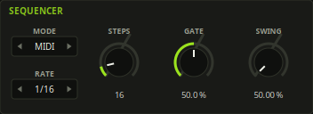

Set **Mode** to Sequencer and the plugin plays itself.

It runs off the **host's beat timeline**, re-read at the top of every block, so
scrubbing, looping and tempo changes all land where they should. Inside the
block the audio is split again at every step boundary, so a note starts on the
sample it is due on and not on the next buffer. If the host is stopped, or has
no transport at all, a held MIDI note runs the pattern anyway — at the project's
tempo, which a stopped host still reports, or at 120 BPM if there is no
transport at all — so it can be auditioned without putting the song into play.

A held MIDI note **transposes** the pattern rather than sounding. **C2 is the
pattern as written**; releasing everything puts it back.

When the pattern is running off a key rather than off the host's transport,
**pressing a key starts it again from step one**. That is the only way to place
the first step where you want it without a transport, and it is what the
machine's own keyboard did. With the host playing, a key only transposes: the
position belongs to the song, and a pattern that jumped back to step one in the
middle of a bar would be out of step with everything else in the project.

### How long a pattern is

**Steps** runs from 1 to 128, and the two ends of that are two different
instruments.

Below sixteen is the machine's own trick: fifteen steps against a four-four bar
walks the pattern around the beat, and the pattern never lands in the same place
twice until it has been round fifteen times. Sixteen is the machine.

Above sixteen the sequencer stops being a bass figure that repeats every bar.
Sixty-four steps is four bars of sixteenths, 128 is eight, which is long enough
to put a melody in rather than a riff. The pattern generator fills exactly as
many steps as Steps says, and its draws are per step and in order — so turning
Steps up **extends** the line the seed already described rather than replacing
it.

The grid draws sixteen columns for a pattern of sixteen or fewer and thirty-two
for anything longer, at half the cell width. Whatever does not fit is scrolled
to: roll the wheel anywhere over the grid, drag the bar under it, or click the
track either side of the bar to move a screenful. While the sequencer is
running the grid follows the playing step onto its own screen. The title says
which part of the pattern is on show — *PATTERN 1 33-64/128*.

### The grid

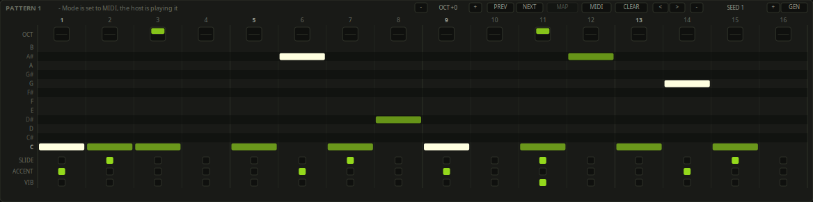

Sixteen steps across, below the panels — or thirty-two of a longer pattern, as
above.

- The **piano roll** is twelve semitones with C at the bottom and the black keys
  on darker lanes. Click a cell to put a note there, click it again (or
  right-click anywhere in the column) to clear the step, and **drag to paint**.
  An accented step is drawn bright — an accent is the first thing you look for
  when reading somebody else's pattern.
- **Drag along one row and you draw a long note.** It covers as many steps as
  you drag it over and is drawn as one continuous bar, and what it writes is
  the note on every step with a slide out of all but the last — which is what a
  held note has always been on this machine, entered in one gesture instead of
  eight. Drag back over it to shorten it. Leave the row and it is a new note,
  so a diagonal drag still paints a melody.

  The slide *is* the tie, so the SLIDE lane edits the length of a long note:
  turn one off in the middle and the bar splits into two notes at that step,
  turn it back on and it is one note again. A slide between two *different*
  pitches is a glide rather than a tie, and stays drawn as two notes, because
  that is what you hear.

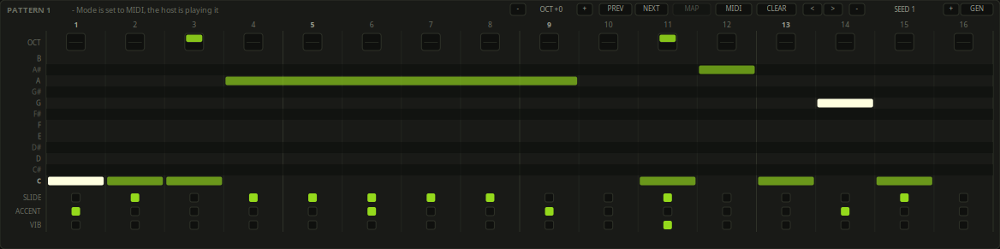

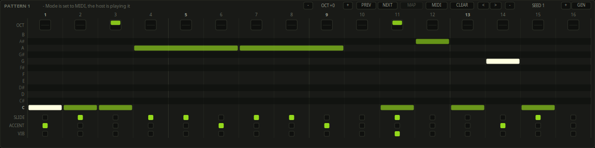
- The **OCT** row above it moves a step up to **two octaves either way**. Click
  the top half to step up, the bottom half to step down, one octave a click, as
  far as +2 and −2; the right button puts a step straight back to the middle.
  **Up is drawn in the accent green and down in amber**, and one octave fills
  half the box where two fill most of it — so which way is a colour and how far
  is a length, and neither has to be worked out from the other. The machine had
  one switch position each way; two is a sequencer feature, and it is what lets
  a line hold a bass note and a lead in the same sixteen steps.
- **SLIDE**, **ACCENT** and **VIB** below. Click or drag.
- Steps past the pattern's length are greyed; the playing step is lit.

**CLEAR** empties it, all 128 steps of it and not only the part on screen. The
two **arrow** buttons walk the whole pattern one step sideways under the bar,
which is the quickest way to find out that a line you liked was starting in the
wrong place. **MIDI** drags the pattern out of the
plugin — see *Taking the pattern with you* below. The rest is the generator.

All of it applies to whichever pattern the bank has selected — which is not
necessarily the one sounding, because a running chain moves on without the
editor following it. The playhead is only drawn when the two are the same.

### Live mode, and playing patterns from a pad

Set **Mode** to **Live** and the keyboard stops transposing the pattern and
starts selecting them instead. Everything else about the sequencer is the same.

That swap is the whole feature. In Sequencer mode a held key moves the pattern
by semitones, which is what the machine's own keyboard did and is the wrong
thing entirely when you are standing in front of a pad controller and the thing
you want the pads to do is change pattern. In Live mode:

- **A key the map does not know about simply runs the pattern**, at the pitch
  it was written at. That is how you start it without a transport, exactly as
  before — you just no longer have to pick the right key.
- **A mapped key selects its pattern**, or steps the bank one either way.
- **Stepping stops at the ends.** Next on the last pattern stays on the last,
  prev on the first stays on the first. A pad that does nothing at the end of
  the bank is better than one that lands on pattern 1 halfway through a bar.
- **Pattern Oct** moves the whole running pattern by octaves — see below.

**Building the map.** Press **MAP**, on the row above the grid; the bank turns
into the pad layout and says so. Then, for each pad:

1. Click what you want it to do — a pattern in the bank, or the **PREV** or
   **NEXT** button.
2. Play the note you want to do it. That is the whole of the learning.

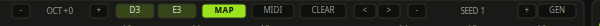

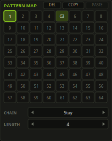

The cell or button then shows the note that reaches it. **Right-click** one to
unbind it, and right-click **MAP** to clear the whole map at once. Press MAP
again to go back to the ordinary bank. Selecting a pattern with the mouse is
unaffected while the map is open, so a layout can be built while a pattern
plays.

Two things worth knowing:

- **One note does one thing.** Learning a note onto a new target takes it off
  whatever it did before, so a pad cannot quietly end up doing two jobs.
- **The map is saved with the project, not with the preset.** A pad layout
  belongs to your rig rather than to a sound, and browsing presets in the
  middle of a set must not silently remap the controller. Nothing in a preset
  file mentions it.

PREV and NEXT are ordinary buttons the rest of the time, and step the bank when
clicked — the same call the pads make, so the two cannot drift apart.

### Moving the whole pattern: Pattern Oct

**OCT**, with its **−** and **+** beside the MAP button, moves the entire
running pattern by octaves without touching a single step. Click the reading
itself to put it back to zero.

It exists because Live mode takes the keyboard away, but it is not limited to
Live mode: in MIDI and Sequencer mode it adds to the held-key transpose, so a
line written low can be played an octave up without rewriting it or holding
anything down. It is an ordinary parameter, so a host automates it like a knob.
A step that would land outside MIDI's own range is clamped rather than wrapped,
so a pattern pushed four octaves up flattens at the top instead of folding back
into the bass.

### The pattern bank

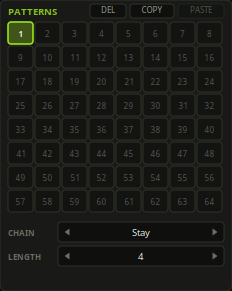

Beside the grid, eight by eight: **sixty-four patterns**. Click one to edit it,
or roll the wheel over the grid to step through them. A pattern with something
written in it is filled, the selected one is outlined in the accent, the one
sounding is ringed, and the ones the chain will reach are lit.

The machine had sixty-four too, and a mode switch to reach them.

**DEL**, **COPY** and **PASTE**, in the bank's own title row, are how the bank
is kept. COPY and PASTE make a pattern a variation of another one: copy it,
click an empty slot, paste, and change the two steps you wanted to change.
PASTE stays greyed until something has been copied, and DEL until there is
something to delete. The clipboard is the editor's — it lasts as long as the
window is open, and it is not in the preset, the state or the parameter list.

**DEL empties the selected pattern**, which is the same edit CLEAR makes on the
grid, put where the patterns are: emptying a slot you are not editing is
something you do while looking at the bank. Like everything else here it is not
undoable, which is the deal a hardware sequencer offers — and the reason to
COPY first if there is any doubt.

**CHAIN** is what happens when a pattern has played through.

| Chain | After each time round |
|---|---|
| **Stay** | repeat the selected pattern. The hardware's behaviour, and the default. |
| **Next** | step to the following pattern, wrapping round at **Length**. Four patterns make a sixty-four step line. |
| **First** | play the selected pattern once, then stay on pattern 1. |
| **Random** | pick one from inside the chain each time round. |

**LENGTH** is how many patterns the chain covers, counting from pattern 1. Stay
and First ignore it. A pattern selected from outside the chain is where the
chain starts, and after that it runs inside it.

Which pattern plays is worked out from the host's beat position — not counted up
as the sequencer goes — for the same reason the steps are. A loop, a seek or a
scrub therefore lands on exactly the pattern it should, Random included: the same
bar of the song always picks the same pattern, however it was reached.

The selected pattern, the chain mode and the chain length are ordinary
parameters, so a host can automate a pattern change like any other knob. The
sixteen steps inside a pattern are not, and deliberately so — eighty values per
pattern would make a mess of any host's parameter list. The consequence is that a
pattern edit is not automatable and the host's undo does not see it, which is the
same deal a hardware sequencer offers.

The whole bank travels in the preset file and in the plugin's state. Only the
patterns with something in them are written out.

### Taking the pattern with you

A line worth keeping is often a line you want to *edit* — in the arranger, as
notes, with the rest of the track around it. There are two ways out, and they
carry the same thing.

**The note output port.** The plugin has a note output as well as an input, and
in Sequencer mode everything the sequencer plays goes out of it: route it to
another track and record the line as it plays. What comes out is what you hear,
including the transposition a held key applies.

**Drag the MIDI button.** Press **MIDI** above the grid and drag into the host's
arranger. The selected pattern is written to a temporary `.mid` file and dropped
where you let go — which is how a DAW takes MIDI from anything else. A click
that does not move drops nothing.

Both use the same three conventions, and they are the ones this plugin reads
back in MIDI mode, so a recording played into it again sounds like what it came
from:

| In the pattern | In the MIDI |
|---|---|
| **Accent** | a velocity above the **Acc Thresh** parameter — 127, against 80 for a plain step |
| **Slide** | the note is still held when the next one starts. The overlap *is* the slide |
| **Vibrato** | CC1 up for the length of the note and back down after it |
| **Octave**, **Gate**, **Rate**, **Swing** | the key, the length and where the note falls |

The dragged file carries the project's tempo and a 4/4 time signature, at 960
ticks to the quarter note — which divides exactly by three, so a triplet rate and
a triplet swing both land on whole ticks rather than between two of them.

| Control | Range | Default | |
|---|---|---|---|
| **Mode** | MIDI / Sequencer | MIDI | Where the notes come from. |
| **Rate** | 1/32 – 1/8 | 1/16 | How long one step lasts. The triplet settings are not something the hardware could do. |
| **Steps** | 1 – 16 | 16 | How many steps before it repeats. The machine took the same range, and the interesting part of it is the bit that is not 16: fifteen sixteenths against a four-four bar walks the pattern round the beat and comes back after fifteen bars. |
| **Gate** | 0 – 100 % | 50 % | How much of its step a note holds. It does not apply to a step marked Slide — that one holds past the next step's start on purpose. |
| **Swing** | 50 – 75 % | 50 % | Delays every second step. 66.7 % is triplet swing. The hardware's steps were exactly even. |
| **Pattern** | 1 – 64 | 1 | Which pattern the grid edits, and the one the chain starts from. |
| **Chain** | Stay / Next / First / Random | Stay | What happens when a pattern has played through. |
| **Chain Length** | 1 – 64 | 4 | How many patterns the chain covers. Only Next and Random use it. |

### Vibrato *(added)*

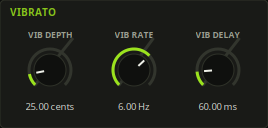

| Control | Range | Default | |
|---|---|---|---|
| **Vib Depth** | 0 – 200 cents | 25 | How far a vibrato step bends. In MIDI mode the mod wheel (CC1) scales it, since there is no step to carry the bit. The top of the range is a whole tone either way — past vibrato, and into something the note is doing on purpose. |
| **Vib Rate** | 0.5 – 20 Hz | 6 Hz | How fast. |
| **Vib Delay** | 0 – 400 ms | 60 ms | How long the note waits first, after which it ramps in over 80 ms. At zero it is already wobbling when the note starts, which sounds like a mistake rather than like playing. A slide does not restart the wait. |

## 7. The pattern generator

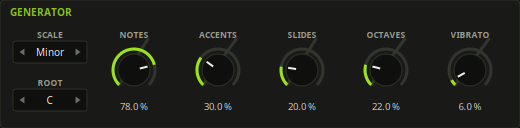

A seed, a scale, a root and five densities. **The same settings always give the
same sixteen steps**, so a line worth keeping is a number you can write down
rather than a file you have to find.

**GEN** gives a new pattern, every press. It picks a seed you have not heard
and generates from it, which is what the button is for -- press it until
something good happens. The seed it picked is shown beside it and is an
ordinary parameter, so the line you just kept is a number: write it down, and
it comes back.

Step the seed with the **−** and **+** buttons beside the grid and the pattern
regenerates as you go, one seed at a time. That is the other way to use it:
hold the settings still and walk through seeds until one of them is the one.
Those two buttons are the deterministic half, GEN is the dice.

Two things make it a generator rather than a random number generator wired to a
piano roll.

**It changes one thing at a time.** Every step draws all of its random values
whether or not it uses them, so turning Accents up changes which steps are
accented and leaves the notes exactly where they were. A generator that
reshuffled the line on every tweak would be a slot machine. Octaves are the one
deliberate exception: a jump is far likelier on an accented note, because
accent-plus-octave is *the* gesture, so moving the accents does move some
octaves.

**It knows some things about bass lines.** The root comes up far more often than
any other degree and almost always starts the pattern; the first step of each
beat is likelier to sound and likelier to be the root; octave jumps prefer
accented notes; and a slide into a rest is taken out afterwards, because it
slides into nothing. Uniform noise over twelve semitones does not sound like a
bass line and never did.

Measured over 400 seeds: the root is **44 %** of all generated notes, rests are
19 %, and octave jumps 21 % with a third of them downward.

| Control | Default | |
|---|---|---|
| **Seed** | 1 | Which pattern. **0 – 4,294,967,295**, which is the whole of a 32-bit word and is wide enough to take a Unix timestamp — so "seed it from the clock" is a thing you can actually do here, and you will not hear the same line twice. The **−** and **+** buttons step it and wrap at both ends; **click the reading to type one**, which is the only way across a range this size. It is the one control in this table that is **not** on the GENERATOR panel: it is up beside the step grid, next to the − and + buttons that step it and the GEN button that rolls it, which is where it is used. It is an ordinary parameter either way and a host automates it as one. |
| **Scale** | Minor | Which notes it may use. Minor is where nearly every acid line lives; Chromatic is for when it should not make sense. |
| **Root** | C | What the scale is built on. It moves the notes inside the octave rather than transposing the result — to move the line, hold a MIDI note. |
| **Notes** | 78 % | How many steps get a note at all. The rests matter more than they look: a pattern with a note on every step has no shape. |
| **Accents** | 30 % | |
| **Slides** | 20 % | Worth keeping low. A slide only reads as one when the notes around it do not. |
| **Octaves** | 22 % | Mostly up; one jump in three is down. |
| **Vibrato** | 6 % | Nothing on the machine does this, so the default is sparing. |

## 8. Presets, folders and packs

Presets are text files in your own preset directory
(`$XDG_CONFIG_HOME/SaeureKiste/presets`, or `%APPDATA%\SaeureKiste\presets` on
Windows), and the twenty-seven factory presets are compiled into the plugin.
The browser opens by clicking the preset name on the bar.

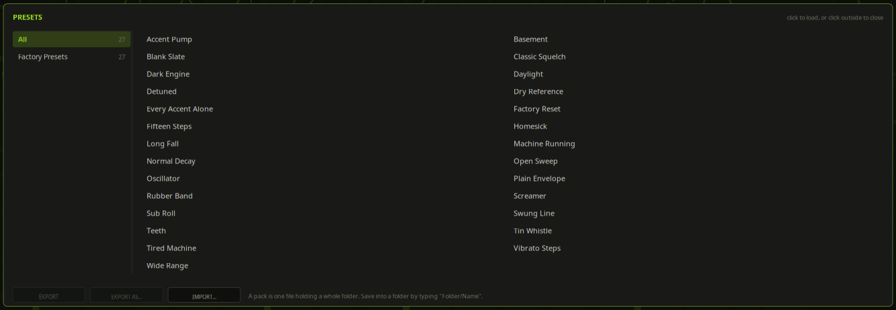

**The library has folders.** Down the left of the browser is a column of them:
*All*, then *Factory Presets*, then whatever you have made, then *Unfiled* for
presets saved without a folder. Click one to see what is on it; the count
beside each is how many presets it holds. A folder is one directory under your
preset directory — one level deep, because a preset library is a shelf rather
than a filesystem.

**A folder is made by saving into it.** In the save field, type `Folder/Name`
instead of a name: the folder is created if it is not there and the preset lands
in it. There is no second dialog and no way to make an empty folder, which is
the right answer for something whose only job is to hold presets.

**A preset pack is a whole folder as one file** — `<name>.saeurekistepack`,
which is the preset format again with a separator line between the presets, so
it can be read and edited by hand like everything else here. The footer of the
browser has three buttons:

| Button | |
|---|---|
| **EXPORT** | Writes the selected folder to `…/SaeureKiste/packs/<folder>.saeurekistepack` and says where it went. |
| **EXPORT AS…** | The same, through the desktop's own file chooser, for handing the pack to somebody else. Only shown when there is a chooser to open — zenity or kdialog on Linux, the system one on Windows. |
| **IMPORT…** | Lists the packs in the packs folder, plus *Other file…* for one from anywhere else. |

An import never overwrites anything: the pack becomes a new folder named after
itself, and importing the same pack twice gives two folders rather than a
mixture of both versions in one. A pack carries each preset's text exactly as it
was written, so the patterns inside a preset travel with it.

### The factory library

| Preset | |
|---|---|
| **Factory Reset** | The machine's own middle position, and the reference the others were built against. Leaves the pattern bank alone. |
| **Blank Slate** | The same, and the sequencer with it: the bank emptied down to one bar of C in pattern 1, no octaves, slides, accents or vibrato anywhere. Where you start when you want to write a line rather than edit one. |
| **Dry Reference** | Every added stage off: no drive, tone fully open, master at unity. The signal path the schematic draws and nothing else. Start here when comparing against a recording. |
| **Classic Squelch** | Resonance high, envelope sweeping nearly its whole range, decay short enough that the peak falls back before the next sixteenth. |
| **Dark Engine** | The square wave, low and almost closed. |
| **Open Sweep** | Decay at 1.6 s, so the filter never finishes closing between notes and the line reads as one movement. |
| **Long Fall** | Decay at the knob's maximum, 2.5 s. |
| **Sub Roll** | Env Mod at zero: no sweep, no bias shift, just a filtered oscillator holding the bottom. |
| **Accent Pump** | Sweep Time at 180 ms, well past the circuit's 68. Accents build instead of repeating. |
| **Every Accent Alone** | Sweep Time at 20 ms. Nothing carries over. The same instrument with the hardest-to-hear half removed. |
| **Screamer** | Resonance near the top with the drive hard into its clipper. |
| **Tin Whistle** | The square up where it is thin rather than hollow. |
| **Rubber Band** | Slide Time at 150 ms — longer than a sixteenth, so slid notes arrive between the two pitches they were written as. |
| **Wide Range** | Filter tracking at 60 %, for a line written across three octaves. |
| **Detuned** | Fourteen cents flat, against anything else in the track that is exactly in tune. |
| **Normal Decay** | Acc Decay matched to Decay: accents stay louder and brighter but stop being shorter. |
| **Oscillator** | Res Range at 120 %, so the ladder sings instead of ringing. |
| **Tired Machine** | Drift at 55 %. Nothing quite holds still. |
| **Plain Envelope** | Env Bias at zero — the gimmick switched off, for comparison. |

### Driving their own sequencer

| Preset | |
|---|---|
| **Machine Running** | The plain case: sixteen steps, three slides, four accents. |
| **Fifteen Steps** | The same with Steps at 15, so the pattern walks around the bar. |
| **Swung Line** | Swing at 66.7 %, which the hardware could not do at all. |
| **Vibrato Steps** | Eighth notes with a vibrato on four of them. |
| **Daylight** | *Happy.* Major pentatonic, short and bright, a little swing, both slides moving upward and not a minor third anywhere in it. |
| **Homesick** | *Sad.* Natural minor at half speed, long decay, a gate that nearly fills its step so notes lean into each other, and a delayed vibrato on two of them. Ends on a D that does not resolve. |
| **Teeth** | *Beasty.* 92 % resonance, Acc Sweep at 4.5 octaves, the drive at 85 % and the ladder driven half again as hard as the circuit drives it. Almost every step accented, so with Acc Build at 85 % the accent circuit never empties and the whole bar climbs. |
| **Basement** | *Dark.* The square an octave down, cutoff almost shut, a decay long enough that the filter never finishes closing. Minor seconds and tritones, seven notes in sixteen steps, and Acc Decay at 600 ms so an accent swells instead of stabbing. |

## 9. The window

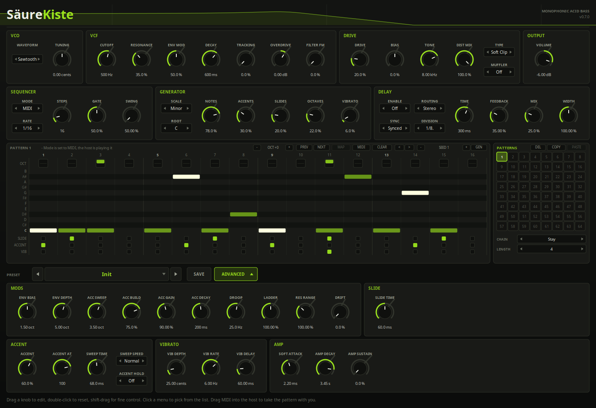

One row of knobs across a wide, shallow panel, which is the shape of the machine
it models — and a second row of them behind a button, because ten of the
controls are for tuning the engine rather than for playing it.

- **Drag** a knob to edit it; **double-click** to reset it; **shift-drag** for
  fine control; **click a value** to type one.
- **Click a chip's arrows** to step an enumerated control, or the chip itself
  for its list.
- The **preset bar** browses the factory library and anything in your own preset
  directory; **SAVE** writes a new one there.
- **ADVANCED**, beside SAVE, opens the collapsible half of the window: the ten
  mods, and the ACCENT, SLIDE and VIBRATO panels. The window grows to make room
  and shrinks again when you close it, and it remembers which way you left it.
  A host that will not resize a plugin editor on request will leave it clipped;
  everything in it is reachable from the host's own parameter list either way.
- **Clicking the version label** plays one low accented note, so a preset can be
  auditioned without reaching for a keyboard.
- The curve across the **header** is the ladder's actual response — the same
  transfer function the DSP uses, unequal capacitor included — sweeping down
  after every note the way the envelope does.

## 10. The modified machine

The silverbox has one famous hardware modification, made and sold since the
early nineties, which adds eight controls the original never had. Its author
publishes a manual for it, and that manual is a good source of a different kind
from the service notes: it documents what each addition *does*, in numbers,
rather than printing a schematic. Everything in this chapter comes from it.

**Every control here defaults to the stock circuit.** That manual has a section
on limiting the modification to the original's own sounds, a table of where to
leave each control so the machine behaves like an unmodified one; those are the
defaults. It is not merely claimed, either: left where they are, these controls
give back exactly the audio the instrument made before any of them existed —
the same samples, not merely a similar sound.

### The controls

**Overdrive** *(VCF)* is the oscillator's level into the filter. It is not
`Drive` — this one is in front of the ladder and `Drive` is behind it. 0 dB is
the fixed level the machine has. Above that the ladder's input pair stops being
linear and starts switching, which is the manual's "the filter operates under
duress"; the top of the range is its 66.6 times normal. At the bottom the
oscillator is gone altogether, and that setting is only interesting with
`Res Range` past 100 %: the filter sings on its own and Overdrive reintroduces
the oscillator by hand.

**Filter FM** *(VCF)* feeds the amplifier's own output back into the filter
frequency, at audio rate. It is loudest where the signal is loudest, so it bites
hardest on accented notes and wherever Overdrive is up, and it needs resonance
to have anything to work with. A little is edge. A lot is what that manual calls a
spluttering chaotic mess, and that is exactly what it is. While it is up the filter
coefficients are recomputed every sample instead of every eighth, which is what
audio-rate modulation costs and why it is off by default.

**Muffler** *(DRIVE)* is a clipper on the output — Off, Soft, Hard. It only
touches signals that are already loud, and it leaves the bottom of the spectrum
alone, so what it takes off is the top of the loudest peaks rather than the
weight of the note. Measured on a stock line: Soft raises the spectral centroid
10 %, Hard 34 %, both within 1.5 dB of the same level. That is the buzz, not a
volume control.

**Soft Attack** *(AMP)* is how fast the amplifier opens on an unaccented note,
0.3 to 30 ms. The machine's is fixed by C41 and R134 at 2.2 ms, which is the
default and is as good as instant; an accented note always uses it whatever this
says. Turned up, the note swells instead of starting — the one thing the original
cannot do.

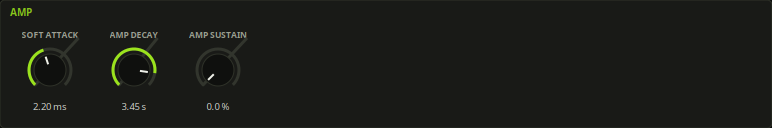

**Amp Decay** and **Amp Sustain** *(AMP)* are the volume envelope, which the
machine gives you no way to reach: R123 and C42 fix its decay at 1.5 s, reaching
a tenth in about 3.45 s, and that is the default. It is long enough that over a
sixteenth note nothing happens, which is why the machine's amplifier holds while the
filter falls. Shorten it and the notes start closing on their own. Amp Sustain
is where the decay falls to instead of silence, so a held note can run
indefinitely.

**Sweep Speed** *(ACCENT)* is how the accent circuit answers accents in quick
succession.

| | |
|---|---|
| **Normal** | The machine. Charge left in C62 from one accent makes the next one bigger — you poke it and it squeals, you poke it again and it squeals more. |
| **Fast** | The opposite. The output is the pulse that was just added rather than what has accumulated, so a residue makes the next one *smaller* and the first accent of a run is the strongest. |
| **Slow** | Rises more gently to about twice as far, and takes longer to cool, so it is still settling through the notes that follow. |

The manual describes what these three do without giving component values — there
is no schematic for the modification — so Normal is the machine and the other
two are fitted
to that description. `Sweep Time` and `Acc Build` remain the controls.

**Accent Hold** *(ACCENT)* accents every note whatever its step or velocity says.
The modification's front panel has a pushbutton for it.

### The widened ranges

Four controls kept their defaults and grew their travel:

| | Was | Now |
|---|---|---|
| **Cutoff** | 100 Hz – 2.5 kHz | 30 Hz – 5 kHz |
| **Decay** | 200 ms – 2.5 s | 30 ms – 3 s |
| **Slide Time** | 10 – 300 ms | 10 – 360 ms |
| **Res Range** | 50 – 130 % | 50 – 200 % |
| **Tracking** | 0 – 100 % | 0 – 200 % |

A project saved before this converts on load: for a logarithmic control the
saved value is a position on the curve, not a frequency, so widening the curve
would otherwise move it. Preset files were never at risk — they are written in
real units.

### What is not modelled

The part of the modification that is jacks: the external audio input into the
filter, the audio Filter FM input, the Filter Out tap, and the CV and gate
sockets. Those want an audio input port and a second output, which is a
different shape of plugin. The modification's MIDI retrofits need nothing at all here.

## 11. Where the numbers came from

Every number in this instrument is one of four things: read off the schematic,
printed in the service notes, derived from the two, or fitted because neither
gives it.

**The fitted ones are all controls.** They are the Mods panel, and the number
that was guessed is that control's default — so the guesses are a starting
point you can disagree with rather than decisions made on your behalf and
buried. That is the rule the whole instrument is built on: anything that could
be read off the circuit is fixed, and anything that could not is a knob.

The honest summary: this is fitted to a circuit diagram and an alignment
procedure. It has never been listened to against a real one.
