# {{PLUGIN}} — manual

*Eight synthesised layers, effect chains in any order, a rumble floor,
modulation and over a hundred presets. Linux and Windows, CLAP and VST3.*

Version {{VERSION}}

---

[TOC]

## 1. What it is

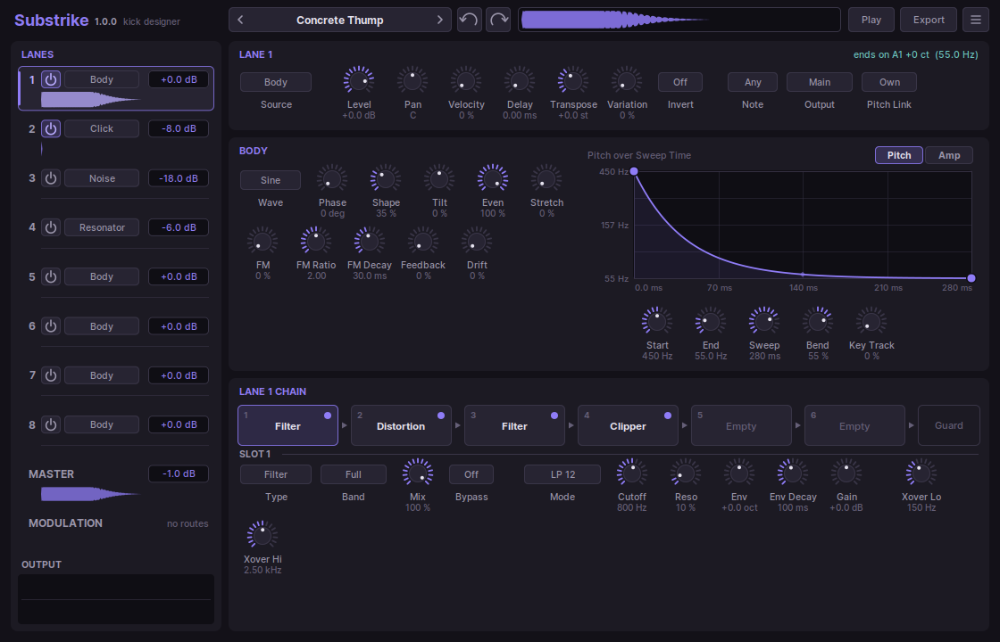

Substrike builds kick drums. Not one kind of kick: the soft round thud of
deep house, the dusty knock of a hip hop loop, a long tuned sub boom, the
overdriven brick of hard techno with a rumble floor underneath it, the zap
and the screeching tail of hardstyle, the distorted wall of gabber, an
acoustic bass drum in a room, or something that has never been a kick
before.

Everything is synthesised. There are no samples inside. A kick is made of
up to **eight lanes**, each a layer with its own sound source and its own
chain of six effects; a **master** chain shapes the sum. Lanes can feed one
another, which is how a rumble is made: a copy of the kick, driven into a
reverb, flattened into a deep floor and tucked under the next hit.

A **modulation matrix** lets velocity, the note, a random value, LFOs,
drawn envelopes, macros and the lanes' own levels move almost any control,
so a kick can change with how hard it is played, drift from bar to bar, or
never sound the same twice.

## 2. Installing

Copy the plugin where your host looks for plugins:

| | CLAP | VST3 |
|---|---|---|
| Linux | `~/.clap/Substrike.clap` | `~/.vst3/Substrike.vst3` |
| Windows | `C:\Program Files\Common Files\CLAP\Substrike.clap` | `C:\Program Files\Common Files\VST3\Substrike.vst3` |

Then let the host rescan its plugins. Substrike is an instrument: put it on
an instrument track and play it with notes. The factory presets are inside
the plugin; there is nothing else to install.

Your own presets, exported hits and settings are kept in
`~/.local/share/Substrike` and `~/.config/Substrike` on Linux, and in
`%APPDATA%\Substrike` on Windows.

## 3. The first five minutes

1. Click the **preset name** at the top of the window. The browser opens.
2. Pick a category on the left, then click presets in the middle: each one
   loads and plays at once. **Up** and **Down** step through the list.
3. Close the browser (**Esc**) and play the kick from your keyboard or a
   clip. Any note plays it; the note **C2** plays it as it was designed.
4. Click the **waveform in the top bar** to hear the hit without a keyboard,
   or click **Play**.
5. Change something. Every change is redrawn in the waveform at once, and
   **Ctrl+Z** takes it back.
6. When you like it, **drag the waveform** from the top bar into your
   host's arrangement: it arrives as a 24-bit WAV.

## 4. The window

The window has four areas.

- **The top bar**: the preset name with the previous and next arrows,
  **undo** and **redo**, the current hit as a waveform (click it to play,
  drag it out to export), **Play**, **Export** and the menu.
- **The rack** on the left: the eight lanes, the master and the modulation,
  each a row. Click a row to edit it. A lane's row has its power switch, its
  source, its level and its share of the hit as a small waveform. At the
  foot of the rack, **Output** is a live oscilloscope of what the plugin
  plays right now.
- **The right side** shows the selected row: for a lane its strip of
  controls, its source and its effect chain; for the master its controls,
  the whole hit and the master chain; for the modulation the macros, the
  modulators and the matrix.
- **Notices** appear briefly at the top (a saved file, nothing to undo).

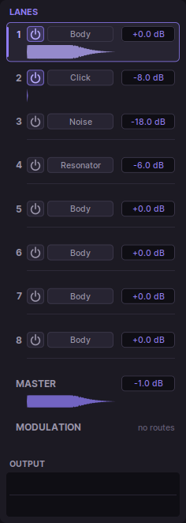

Every knob works the same way: **drag** up and down (**Shift** for fine
steps), turn the **mouse wheel**, **double-click** to type a value
(units work: `1.5 s`, `2.4k`, and note names for frequencies: `A1`),
**Ctrl-click** for the default. **Right-click** a knob to modulate it.

The menu (the three lines at the top right) sets the window size and
scaling, whether exported hits are normalised, and whether presets play
when you load them.

## 5. Lanes

Each lane is one layer of the kick. Lane 1 starts as the body; lanes 2, 3
and 4 start as a click, a noise layer and a resonator, switched off, so
switching one on gives something sensible at once.

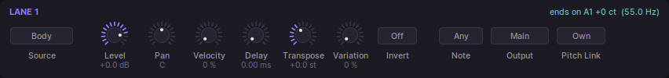

| Control | What it does |
|---|---|
| **Source** | What the lane plays: Body, Click, Noise, Resonator or Bus (see below). |
| **Level**, **Pan** | The lane's level and position in the mix. |
| **Velocity** | How much a soft note lowers the lane. At 0 % every note is full level, the usual setting for a club kick. |
| **Delay** | Plays the lane up to 100 ms after the note, to line up layers or to flam them. |
| **Transpose** | Moves every frequency of the lane's source, filters included, by semitones. |
| **Variation** | Changes pitch, level, decay and noise slightly from hit to hit. At 0 % every hit is identical. |
| **Invert** | Turns the lane's polarity, for when two layers cancel each other. |
| **Note** | Any note, or one note only: give lanes different notes and Substrike becomes a kit. |
| **Output** | Main output, the lane's own output, or both (see *Outputs*). |
| **Pitch Link** | Lets the lane follow another lane's pitch drop, so a click or a resonator stays in tune with the body. |

### Body

The body is the tone of the kick: an oscillator whose pitch falls from
**Pitch Start** to **Pitch End** over **Sweep Time**, and whose level holds
for **Body Hold** and then dies over **Body Decay**.

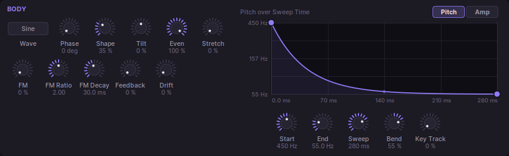

- **Wave**: sine, triangle, saw, square, or **Additive**: eight partials
  shaped by **Tilt**, **Even** and **Stretch**.
- **Shape** saturates the wave (more harmonics, a fatter body). **Phase**
  sets where the wave starts, which changes the very first click of the hit.
- **FM** modulates the body with its own oscillator (**FM Ratio**, **FM
  Decay**); **Feedback** lets it modulate itself. **Drift** adds a slow
  wander.

The **pitch curve** and the **amplitude curve** (the Pitch and Amp tabs)
are drawn. Drag a point to move it (**Shift** for fine steps), drag the
small diamond on a segment to bend it, **double-click** to add or remove a
point or to straighten a segment, **right-click** for a menu. A curve has up
to sixteen points. The knobs under it scale what you drew: Start, End,
Sweep and Bend for the pitch, Attack, Hold, Decay and Bend for the level.
They can be automated and modulated, the drawing stays.

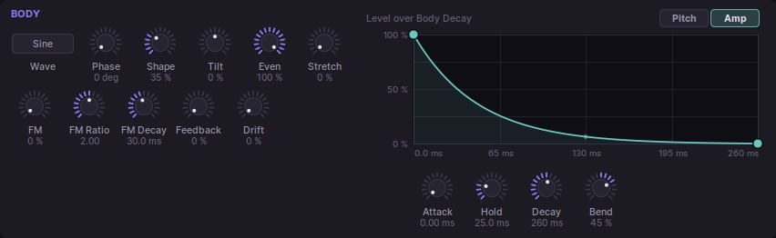

**Key Track** makes the body follow the keys: at 100 % it plays in tune
chromatically, around the **Root Note** set on the master. A tuned sub
boom is a long body with Key Track at 100 %.

### Click

A short transient: an **Impulse**, a burst of **Noise**, a tonal **Blip** or
a **Zap** that sweeps down through several octaves in a few milliseconds.
**Decay** sets its length; its own **Filter** (with **Cutoff** and **Reso**)
shapes it. A click on its own lane, a few decibels under the body, is the
classic beater.

### Noise

Filtered noise with its own envelope: **White**, **Pink**, **Brown** or
**Crackle** (with a **Density**), a **Width** for stereo, a filter whose
cutoff can fall with each hit (**Filter Env**, **Env Decay**), and attack,
hold and decay. For beaters, shell noise, air on top, or texture under a
rumble.

### Resonator

Two to eight damped modes struck by an impulse, a mallet or a burst of
noise: a drum skin (**Membrane**), a harmonic or odd series, or a **Bar**.
**Tune**, **Decay**, **Damping** (how fast the higher modes die),
**Brightness**, **Hardness** of the strike, and a pitch **Drop** after the
hit. Acoustic kicks, tom-like knocks and tuned, ringing drops start here.

### Bus

A Bus lane makes no sound of its own. It plays the lanes switched on in its
panel, taken **before** or **after** their chains (*Tap*), through its own
chain. This is how one kick is used twice: once clean, once as raw
material for a rumble, a delay or a reverb that the other layer never
touches.

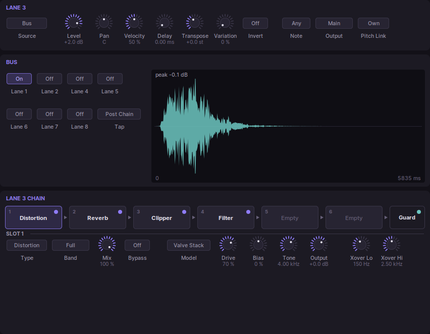

A lane can only take from lanes that do not take from it in turn; two lanes
feeding each other hear silence from each other rather than a loop.

## 6. Effect chains

Every lane and the master have six **slots**, in signal order from left to
right. Click a slot to edit it below the chain; **right-click** or
**double-click** it to choose a type; **drag** it onto another slot to swap
the two; click its **dot** to bypass it.

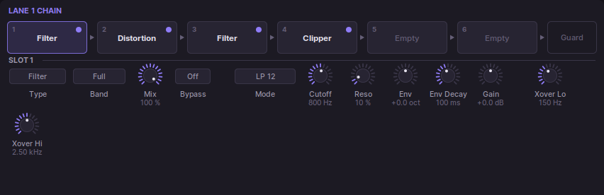

Every slot has a **Type**, a **Band**, a **Mix** and **Bypass**, and up to
six controls whose names and ranges come from the type.

- **Band** processes only part of the spectrum: Full, Low, Mid, High,
  Low+Mid or Mid+High, split at the chain's two crossovers (**Xover Lo**,
  **Xover Hi**). The rest passes the slot untouched, and the sum stays flat.
  Distortion on *Mid+High* drives the body's harmonics and leaves the sub
  clean.
- **Mix** blends the effect with what went in. For Delay and Warp the
  output is the input *plus* the echoes, so Mix is the echo level; for
  Reverb the output is the reverb alone, and 100 % is what a rumble wants.

| Group | Types |
|---|---|
| Drive | **Distortion** (ten models, from Soft Clip to Rectifier), **Clipper**, **Wavefolder**, **Bitcrush** |
| Tone | **Filter** (low and high pass at 12 and 24 dB, band pass, notch, peak; an envelope per hit), **EQ** (shelves, a bell, tilt) |
| Dynamics | **Compressor**, **Transient** (lifts or cuts the attack and the sustain), **Gate** (on level, or *Hit*: from every hit, to cut a tail where you want it), **Limiter** |
| Time | **Reverb** (a dense room for smearing and rumble, not a hall), **Delay** (synced to the host's tempo, colour, drive, ping-pong), **Warp** (echoes that climb or fall in pitch, play backwards, or come as taps), **Smear** (spreads the attack in time without a tail) |
| Other | **Ring Mod** (ring modulation or a frequency shift up or down), **Stereo** (width, a short delay on one side), **Utility** (gain, polarity, channels) |

**Quality** on the master oversamples the drive slots (1x, 2x or 4x): more
is cleaner and costs more processing.

### The transient guard

The **Guard** at the end of every lane's chain keeps a layer out of the
attack. **Delay** keeps the lane silent for that long after each of its
hits, **Fade** then brings it in. **Duck** lowers the lane while another
lane sounds, by **Depth** at that lane's full level, recovering over
**Release**: a sidechain with no cable.

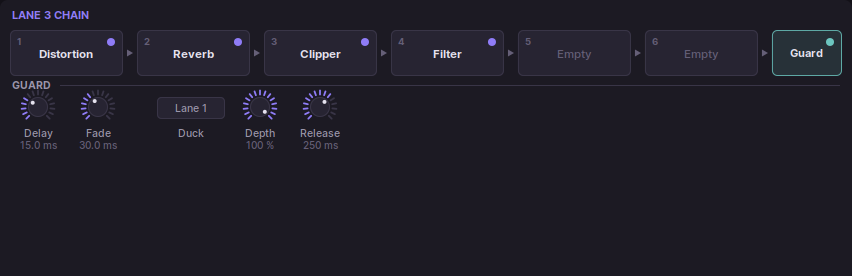

## 7. Making a rumble

A rumble is a deep floor under the kick, centred on the kick's own pitch,
held about ten to fifteen decibels under the kick between the hits and
swelling back towards the next one. Substrike makes it from the kick
itself:

1. Make the kick on lane 1.
2. Switch on another lane and set its source to **Bus**, with lane 1 on.
3. In its chain: **Distortion** to give the reverb something to ring with;
   **Reverb** with **Size** at 100, a long **Decay** (two to four seconds),
   low **Damping** (dark) and **Width** at 0 (mono); a **Clipper** driven
   about 30 dB, which turns the reverb's decay into a level; a **Filter**,
   LP 24, around 100 to 150 Hz.
4. In its **Guard**: a short **Delay** and **Fade** (15 and 30 ms), and
   **Duck** from lane 1 with a **Release** around 250 ms.
5. Set the lane's **Level** until the floor sits where you want it.

The Rumble category has this recipe in many variations: with a hard techno
kick over it, gated, rolling in sixteenths, moved by an LFO, pitched below
the kick, diffused. **Mono Below** on the master keeps everything under its
frequency in the middle.

## 8. The master

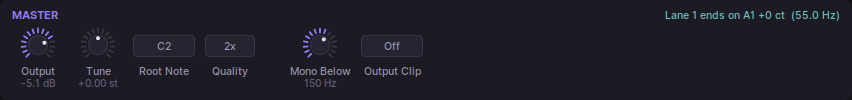

| Control | What it does |
|---|---|
| **Output** | The level of the main output. |
| **Tune** | Moves every lane at once, ±12 semitones to the cent, to put the kick in the key of the track. The strip shows which note the first Body lane ends on, and every Body lane shows its own. |
| **Root Note** | The note that plays the kick as designed; with Key Track, the others transpose from it. |
| **Quality** | Oversampling for the drive slots and the output clip. |
| **Mono Below** | Makes everything below this frequency mono. Off at the bottom of its range. |
| **Output Clip** | **Soft** or **Hard** clips at full scale; **Limit** is a limiter that holds the output under -0.3 dBFS without the distortion of a clip. Off by default. |

The master has its own chain of six slots, after which come Mono Below, the
output clip and the output level.

**Tuning a kick to the track**: look at the note shown at the top right of
the lane or the master ("ends on G1 -36 ct") and turn **Tune** until it
names the key of your track, or a fifth of it. A kick a few cents out of
tune with the bass beats against it; one in tune locks with it.

## 9. Modulation

Click **Modulation** in the rack.

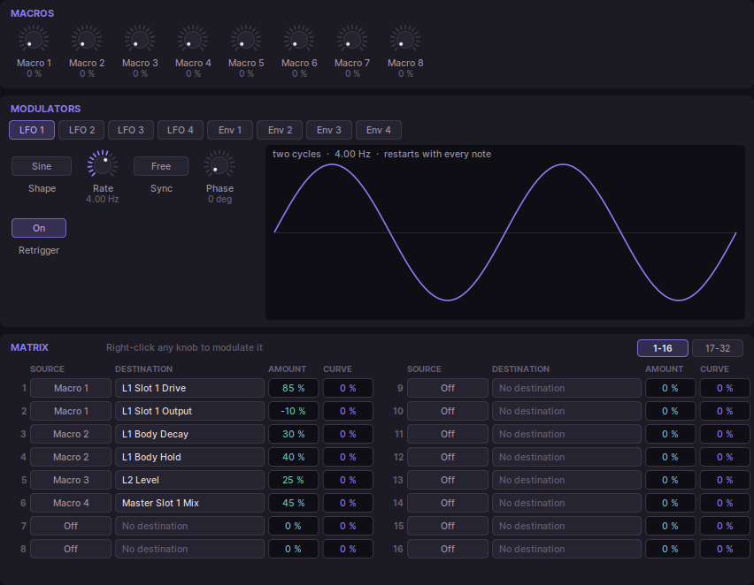

**Sources**

| Source | What it is |
|---|---|
| **Velocity** | How hard the note was played. |
| **Note** | The note against the root note; ±1 at two octaves. |
| **Random** | A new value with every hit. |
| **LFO 1-4** | Sine, triangle, saw up and down, square, sample-and-hold or smooth random. **Rate** in Hz, or **Sync** to note values from the host's tempo. **Retrigger** restarts it with every note; without it, it runs on, and a synced one locks to the song position. |
| **Env 1-4** | A curve you draw (like the Body's), run over its **Time** from every note, once or looped. |
| **Macro 1-8** | Knobs of your own, to map to a controller: one macro can move several controls. |
| **Follow 1-8** | The level of a lane as it plays. |

Velocity, Note and Random belong to each lane: a route onto a lane's
control reads the note that lane played, so in a kit every lane keeps its
own velocity, and each lane draws its own random value.

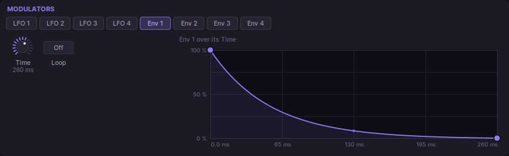

**The matrix** has 32 routes, sixteen on each page. Each route has a
**Source**, a **Destination**, an **Amount** and a **Curve**. The amount is a
share of the destination's whole range, either way: +25 % moves a knob a
quarter of its travel at the source's full value. Routes on the same
control add up. **Curve** bends the source: above 0 it rises early, below
0 late. Click a destination to choose from every control, grouped by lane
and module; right-click it to clear it.

The quickest way in is **right-click on a knob**: *Add* puts a source on it
in the first free route at +25 %, and the routes already on it are listed
there too, to remove or to find in the matrix.

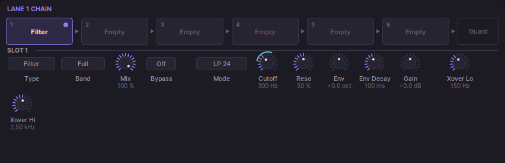

A modulated knob shows a **teal arc** for how far its routes can move it,
and a **bright dot** where the modulation has it right now.

## 10. Presets

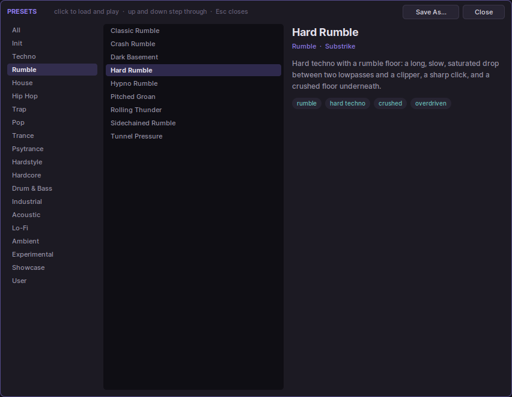

Click the preset name in the top bar to open the browser: the categories on
the left, the presets of one in the middle, and what the preset under the
pointer is on the right. Click a preset to load it and hear it; **Up** and
**Down** step through the list, **Esc** closes. The arrows beside the name
step through presets without opening the browser.

**Save As...** saves the current sound as one of your presets, in the
*User* category. Right-click one of your presets in the browser to delete
it. A preset is a small text file ending in `.substrike`, which you can
copy and share.

Hosts with their own preset browser list Substrike's presets there too,
with their categories and tags.

Loading a preset is a clean start: whatever is still sounding fades out
over a few milliseconds, then the new preset begins from silence, so
nothing of the old sound carries over.

### The factory library

{{PRESET_LIBRARY}}

## 11. Outputs

Besides the stereo main output, Substrike has **eight stereo outputs, one
per lane**. Set a lane's **Output** to *Aux* to send it only to its own
output, or to *Main+Aux* for both. In the host, activate the plugin's extra
outputs and route them to their own channels: the kick and its rumble on
separate faders, each with its own processing and its own sidechain.
The aux outputs carry each lane before the master chain and output level.

## 12. Exporting a hit

**Export** in the top bar renders the current hit at the host's sample rate
and saves it as a 24-bit stereo WAV wherever you choose. **Dragging** the
waveform in the top bar does the same into your host's arrangement or
sampler; the dragged files are kept in the export folder so the host can go
on using them. The menu's **Normalise Exported Hits** raises each export to
-0.3 dBFS; without it, an export is as loud as the hit.

## 13. Undo

Every change you make is a step: **Ctrl+Z** undoes it, **Ctrl+Shift+Z** or
**Ctrl+Y** redoes it, and so do the arrows in the top bar. A whole preset
load is one step. The history stays while the plugin is open, even with the
window closed, and starts afresh when a song is loaded.

## 14. Tips

- **A hard techno kick**: a long, slow pitch drop (Sweep Time around 300
  ms), Shape around 40 %, then in the chain a lowpass around 700 Hz, a soft
  distortion, a lowpass around 350 Hz and a clipper, and a short impulse
  click on lane 2. The lowpasses around the drive make it thick instead of
  fizzy.
- **A tuned sub boom**: Root Note on the key's root, a long Body Hold and
  Decay, Key Track at 100 %, a little soft clipping. Play it as a bassline.
- **Layers that fight**: try **Invert** on one of them, or move one with
  **Delay** by a millisecond or two.
- **Variation** at 10 to 20 % makes a loop of the same kick sound played
  rather than pasted.
- **Velocity** at 0 % on a lane keeps a club kick at full level however the
  notes were played.

## Appendix. Every parameter

Every parameter with its range and starting value, generated from the plugin
itself when this manual was built, under the names the host shows for
automation.

{{PARAMETER_SUMMARY}}
